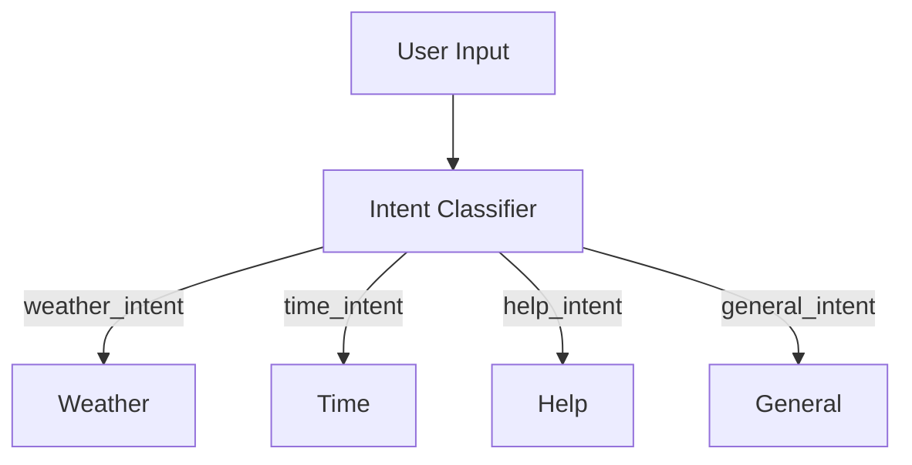

# Branching Intent Flow

Demonstrates branching logic using an intent classifier. Depending on the detected
intent, the flow routes to different handlers.

## Run It

From the `go` directory:

```bash
go run main.go --flow=branching
```

## How It Works



- **Intent Classifier** – examines the user's request.
- **Weather/Time/Help/General** – provide different responses based on the intent.
