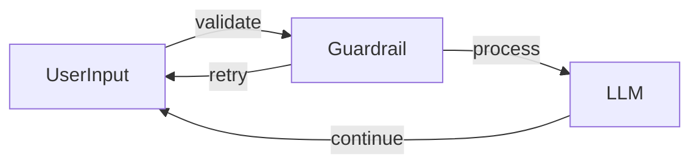

# Chat Guardrail Flow

This flow restricts user queries to travel topics using a validation step before processing with a mock LLM.

## Run It

From the `go` directory:

```bash
# visualize the flow
go run main.go --flow=guardrail --visualize

# execute the flow
go run main.go --flow=guardrail
```

## How It Works



The `GuardrailHandler` performs simple checks to ensure the prompt is travel related. Valid queries are answered by the `LLMHandler`; invalid ones cause the flow to retry.
