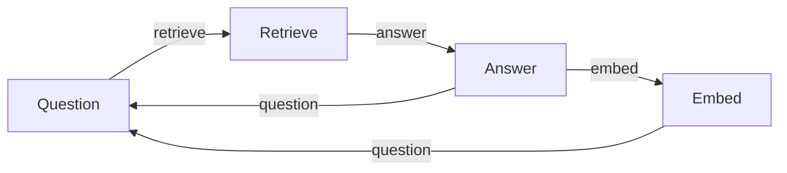

# Chat Memory Flow

This example demonstrates a simple chat application that keeps a short history of the conversation and archives older messages. It mirrors the Python memory cookbook but is implemented using PocketFlow Go.

## Run It

From the `go` directory:

```bash
# visualize the flow
go run main.go --flow=memory --visualize

# execute the flow
go run main.go --flow=memory
```

## How It Works



The handlers simulate:

- Asking a question (`QuestionHandler`)
- Searching archived conversations for relevant context (`RetrieveHandler`)
- Responding with a mock LLM while managing message history (`AnswerHandler`)
- Archiving old messages when the active window exceeds three pairs (`EmbedHandler`)
