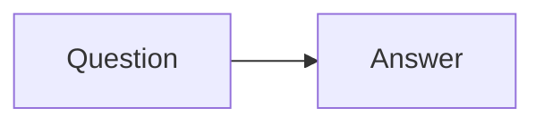

# Question Answering Flow

This example showcases a simple question answering agent built with PocketFlow Go.
It asks a question and generates an answer using a mock LLM.

## Run It

From the `go` directory:

```bash
go run main.go --flow=qa
```

## How It Works

The flow consists of two nodes:



1. **Question** – prompts the user for a question (simulated in the example).
2. **Answer** – uses an LLM interface to produce a response.
