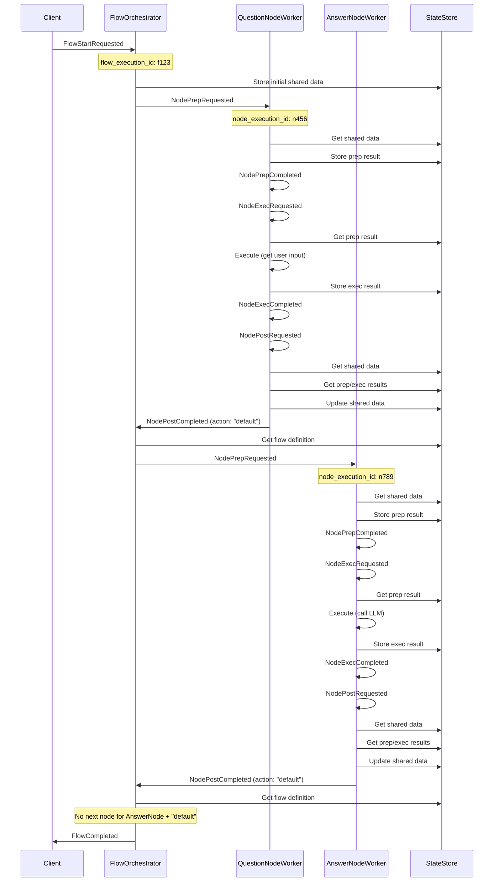

# Event-Driven PocketFlow Design (Go Implementation)

This document outlines a redesign of PocketFlow as an event-driven, pub/sub system implemented in Go, where each node execution is broken down into discrete events.

## Core Design Principles

1. **Topic-Based Communication**: Each node type corresponds to a dedicated topic.
2. **Globally Unique IDs**:
   - `flow_execution_id`: Uniquely identifies an entire flow run
   - `node_execution_id`: Uniquely identifies a specific node execution within a flow
3. **State Management**: Centralized state store maintains shared data and execution context
4. **Asynchronous Processing**: All operations are non-blocking

## Event Types

```go
// Common event fields
type BaseEvent struct {
    EventID          string    `json:"event_id"`           // Unique ID of this event
    FlowExecutionID  string    `json:"flow_execution_id"`  // ID of the overall flow execution
    NodeExecutionID  string    `json:"node_execution_id"`  // ID of this specific node execution
    NodeType         string    `json:"node_type"`          // Type of node (e.g., "SummarizeNode")
    Timestamp        time.Time `json:"timestamp"`          // When this event was created
    CorrelationID    string    `json:"correlation_id"`     // For tracking related events
}
```

### Flow Events

```go
// Flow initialization
type FlowStartRequested struct {
    BaseEvent
    FlowDefinitionID string                 `json:"flow_definition_id"`
    InitialSharedData map[string]interface{} `json:"initial_shared_data"`
    FlowParams       map[string]interface{} `json:"flow_params"`
}

// Flow completion
type FlowCompleted struct {
    BaseEvent
    FinalAction      string `json:"final_action"`
    ExecutionTimeMs  int64  `json:"execution_time_ms"`
}

// Flow failure
type FlowFailed struct {
    BaseEvent
    ErrorMessage     string `json:"error_message"`
    ErrorDetails     string `json:"error_details"`
    FailedNodeType   string `json:"failed_node_type"`
}
```

### Node Events

```go
// Node preparation phase events
type NodePrepRequested struct {
    BaseEvent
    NodeParams map[string]interface{} `json:"node_params"`
}

type NodePrepCompleted struct {
    BaseEvent
    PrepResultRef string `json:"prep_result_ref"` // Reference to stored prep result
}

// Node execution phase events
type NodeExecRequested struct {
    BaseEvent
    PrepResultRef string `json:"prep_result_ref"`
}

type NodeExecCompleted struct {
    BaseEvent
    ExecResultRef string `json:"exec_result_ref"` // Reference to stored exec result
    RetryCount    int    `json:"retry_count"`
}

type NodeExecFailed struct {
    BaseEvent
    ErrorMessage string `json:"error_message"`
    RetryCount   int    `json:"retry_count"`
    WillRetry    bool   `json:"will_retry"`
}

// Node post-processing phase events
type NodePostRequested struct {
    BaseEvent
    PrepResultRef string `json:"prep_result_ref"`
    ExecResultRef string `json:"exec_result_ref"`
}

type NodePostCompleted struct {
    BaseEvent
    Action        string `json:"action"` // The action string to determine next node
    UpdatedDataRef string `json:"updated_data_ref"` // Reference to updated shared data
}
```

### Transition Events

```go
// Node transition events
type NodeTransitionRequested struct {
    BaseEvent
    FromNodeType  string `json:"from_node_type"`
    Action        string `json:"action"`
    ToNodeType    string `json:"to_node_type"` 
    ToNodeID      string `json:"to_node_id"`
}
```

## State Management

```go
// Interface for the state store
type StateStore interface {
    // Store shared data for a flow execution
    StoreSharedData(flowExecutionID string, data map[string]interface{}) error
    
    // Get shared data for a flow execution
    GetSharedData(flowExecutionID string) (map[string]interface{}, error)
    
    // Store the result of a node's prep/exec/post step
    StoreNodeResult(nodeExecutionID string, stepType string, result interface{}) (string, error)
    
    // Get a stored result by reference
    GetNodeResult(resultRef string) (interface{}, error)
    
    // Store flow definition
    StoreFlowDefinition(flowID string, definition *FlowDefinition) error
    
    // Get flow definition
    GetFlowDefinition(flowID string) (*FlowDefinition, error)
}
```

## Service Components

### 1. Flow Orchestrator Service

The Flow Orchestrator manages the overall flow execution and transitions between nodes.

```go
type FlowOrchestrator struct {
    publisher    EventPublisher
    stateStore   StateStore
    flowRegistry FlowRegistry
}

// Handle flow start requests
func (o *FlowOrchestrator) HandleFlowStartRequested(event FlowStartRequested) {
    // Store initial shared data
    o.stateStore.StoreSharedData(event.FlowExecutionID, event.InitialSharedData)
    
    // Get flow definition
    flowDef, _ := o.flowRegistry.GetFlowDefinition(event.FlowDefinitionID)
    
    // Create node execution ID for start node
    nodeExecID := generateUUID()
    
    // Request start node prep
    o.publisher.Publish("node."+flowDef.StartNodeType+".prep.requested", NodePrepRequested{
        BaseEvent: BaseEvent{
            FlowExecutionID: event.FlowExecutionID,
            NodeExecutionID: nodeExecID,
            NodeType: flowDef.StartNodeType,
        },
        NodeParams: flowDef.StartNodeParams,
    })
}

// Handle node post completion to determine next node
func (o *FlowOrchestrator) HandleNodePostCompleted(event NodePostCompleted) {
    // Get flow definition for this execution
    flowDef, _ := o.flowRegistry.GetFlowDefinitionByExecutionID(event.FlowExecutionID)
    
    // Find next node based on current node type and action
    nextNode, exists := flowDef.GetNextNode(event.NodeType, event.Action)
    
    if !exists {
        // Flow is complete, no next node
        o.publisher.Publish("flow.completed", FlowCompleted{
            BaseEvent: BaseEvent{
                FlowExecutionID: event.FlowExecutionID,
            },
            FinalAction: event.Action,
        })
        return
    }
    
    // Create new node execution ID
    nextNodeExecID := generateUUID()
    
    // Request transition to next node
    o.publisher.Publish("node.transition.requested", NodeTransitionRequested{
        BaseEvent: BaseEvent{
            FlowExecutionID: event.FlowExecutionID,
            NodeExecutionID: nextNodeExecID,
            NodeType: nextNode.Type,
        },
        FromNodeType: event.NodeType,
        Action: event.Action,
        ToNodeType: nextNode.Type,
        ToNodeID: nextNode.ID,
    })
    
    // Request next node prep
    o.publisher.Publish("node."+nextNode.Type+".prep.requested", NodePrepRequested{
        BaseEvent: BaseEvent{
            FlowExecutionID: event.FlowExecutionID,
            NodeExecutionID: nextNodeExecID,
            NodeType: nextNode.Type,
        },
        NodeParams: nextNode.Params,
    })
}
```

### 2. Node Worker Service (Example: SummarizeNode)

Each node type has a dedicated worker service that processes its events.

```go
type SummarizeNodeWorker struct {
    publisher  EventPublisher
    stateStore StateStore
    llmClient  LLMClient
}

// Handle prep request
func (w *SummarizeNodeWorker) HandlePrepRequested(event NodePrepRequested) {
    // Get shared data
    sharedData, _ := w.stateStore.GetSharedData(event.FlowExecutionID)
    
    // Execute prep logic (extract text to summarize)
    textToSummarize := sharedData["data"].(string)
    
    // Store prep result
    prepResultRef, _ := w.stateStore.StoreNodeResult(
        event.NodeExecutionID, 
        "prep", 
        textToSummarize,
    )
    
    // Publish prep completed event
    w.publisher.Publish("node.summarize.prep.completed", NodePrepCompleted{
        BaseEvent: event.BaseEvent,
        PrepResultRef: prepResultRef,
    })
}

// Handle exec request
func (w *SummarizeNodeWorker) HandleExecRequested(event NodeExecRequested) {
    // Get prep result
    textToSummarize, _ := w.stateStore.GetNodeResult(event.PrepResultRef)
    
    // Execute the LLM call
    prompt := fmt.Sprintf("Summarize this text in 10 words: %s", textToSummarize)
    
    // Call LLM (with retry logic)
    summary, err := w.llmClient.Call(prompt)
    if err != nil {
        // Handle error and possibly retry later
        w.publisher.Publish("node.summarize.exec.failed", NodeExecFailed{
            BaseEvent: event.BaseEvent,
            ErrorMessage: err.Error(),
            RetryCount: 0,
            WillRetry: true,
        })
        return
    }
    
    // Store exec result
    execResultRef, _ := w.stateStore.StoreNodeResult(
        event.NodeExecutionID, 
        "exec", 
        summary,
    )
    
    // Publish exec completed event
    w.publisher.Publish("node.summarize.exec.completed", NodeExecCompleted{
        BaseEvent: event.BaseEvent,
        ExecResultRef: execResultRef,
    })
}

// Handle post request
func (w *SummarizeNodeWorker) HandlePostRequested(event NodePostRequested) {
    // Get shared data
    sharedData, _ := w.stateStore.GetSharedData(event.FlowExecutionID)
    
    // Get prep and exec results
    _, _ = w.stateStore.GetNodeResult(event.PrepResultRef) // Not used in this example
    summary, _ := w.stateStore.GetNodeResult(event.ExecResultRef)
    
    // Update shared data
    sharedData["summary"] = summary
    
    // Store updated shared data
    w.stateStore.StoreSharedData(event.FlowExecutionID, sharedData)
    
    // Determine action (in this case always "default")
    action := "default"
    
    // Publish post completed event
    w.publisher.Publish("node.summarize.post.completed", NodePostCompleted{
        BaseEvent: event.BaseEvent,
        Action: action,
    })
}
```

### 3. Event Router Service

```go
type EventRouter struct {
    flowOrchestrator FlowOrchestrator
    nodeWorkers      map[string]NodeWorker
    subscriber       EventSubscriber
}

func NewEventRouter(orchestrator FlowOrchestrator, workers map[string]NodeWorker) *EventRouter {
    router := &EventRouter{
        flowOrchestrator: orchestrator,
        nodeWorkers: workers,
    }
    
    // Set up subscriptions
    router.subscriber.Subscribe("flow.start.requested", router.handleFlowStartRequested)
    router.subscriber.Subscribe("node.*.post.completed", router.handleNodePostCompleted)
    
    // For each node type, subscribe to its events
    for nodeType, worker := range workers {
        router.subscriber.Subscribe("node."+nodeType+".prep.requested", worker.HandlePrepRequested)
        router.subscriber.Subscribe("node."+nodeType+".exec.requested", worker.HandleExecRequested)
        router.subscriber.Subscribe("node."+nodeType+".post.requested", worker.HandlePostRequested)
        router.subscriber.Subscribe("node."+nodeType+".exec.failed", worker.HandleExecFailed)
    }
    
    return router
}

func (r *EventRouter) handleFlowStartRequested(eventData []byte) {
    var event FlowStartRequested
    json.Unmarshal(eventData, &event)
    r.flowOrchestrator.HandleFlowStartRequested(event)
}

func (r *EventRouter) handleNodePostCompleted(eventData []byte) {
    var event NodePostCompleted
    json.Unmarshal(eventData, &event)
    r.flowOrchestrator.HandleNodePostCompleted(event)
}
```

## Sample Flow Execution Timeline

Below is a sequence diagram showing a simple flow with two nodes: `QuestionNode` and `AnswerNode`.



## Implementation Considerations

- Use watermill with go pub/sub for now
- Use at-least-once delivery semantics
- Implement idempotent handlers for all events
