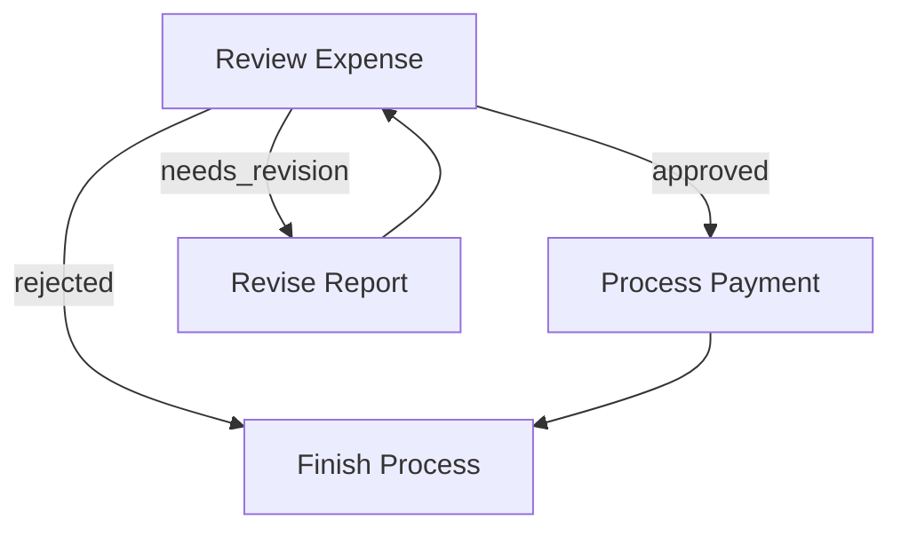

# Go Flow Declarative Builder API

## Overview

This guide introduces a builder-style API for creating declarative flows in Go, inspired by PocketFlow's Python syntax. The Go implementation provides a fluent API that aims to be both idiomatic Go and conceptually similar to the original Python API.

## Key Concepts

1. **Builder Pattern**: Uses method chaining for a readable, declarative style
2. **Action-based Transitions**: Nodes can return actions that determine the next node to execute
3. **Flow Composition**: Flows can be nested within other flows
4. **Type Safety**: Leverages Go's type system for better error detection at compile time

## Basic API

```go
// Define nodes
questionNode := NewNode("question", QuestionNodeConfig{})
answerNode := NewNode("answer", AnswerNodeConfig{})

// Create a flow builder
flow := NewFlowBuilder().
    Begin(questionNode).
    Then(answerNode).
    Build()

// Run the flow
result, err := flow.Run(context.Background(), shared)
```

## Transition Types

### 1. Default Transitions

Equivalent to Python's `node_a >> node_b`:

```go
flow := NewFlowBuilder().
    Begin(nodeA).
    Then(nodeB).
    Build()
```

### 2. Action-based Transitions

Equivalent to Python's `node_a - "action_name" >> node_b`:

```go
flow := NewFlowBuilder().
    Begin(reviewNode).
    On("approved").Then(paymentNode).
    On("needs_revision").Then(reviseNode).
    On("rejected").Then(finishNode).
    Build()
```

### 3. Multiple Source Nodes

For multiple transitions from different source nodes, like this Python example:

```python
node_a - "action_1" >> node_b
node_a - "action_2" >> node_c
node_a - "action_3" >> node_d
node_a - "action_4" >> node_e

node_d - "action_2" >> node_c
node_d - "action_4" >> node_a
```

The equivalent Go code would be:

```go
flow := NewFlowBuilder().
    Begin(nodeA).                  // Set starting node
    On("action_1").Then(nodeB).    // From nodeA to nodeB via action_1
    On("action_2").Then(nodeC).    // From nodeA to nodeC via action_2
    On("action_3").Then(nodeD).    // From nodeA to nodeD via action_3
    On("action_4").Then(nodeE).    // From nodeA to nodeE via action_4
    
    From(nodeD).                    // Switch source node to nodeD
    On("action_2").Then(nodeC).     // From nodeD to nodeC via action_2
    On("action_4").Then(nodeA).     // From nodeD to nodeA via action_4
    
    Build()
```

The `From()` method allows you to switch the source node for subsequent action definitions.

## Examples

### Basic Sequence

```go
// Equivalent to Python: node_a >> node_b
flow := NewFlowBuilder().
    Begin(nodeA).
    Then(nodeB).
    Build()
```

### Branching & Looping

```go
// Define nodes
reviewNode := NewNode("review", ReviewConfig{})
paymentNode := NewNode("payment", PaymentConfig{})
reviseNode := NewNode("revise", ReviseConfig{})
finishNode := NewNode("finish", FinishConfig{})

// Build flow with branches
flow := NewFlowBuilder().
    Begin(reviewNode).
    On("approved").Then(paymentNode).
    On("needs_revision").Then(reviseNode).
    On("rejected").Then(finishNode).
    From(reviseNode).Then(reviewNode). // Loop back
    From(paymentNode).Then(finishNode).
    Build()
```

### Nested Flows

```go
// Payment flow
paymentFlow := NewFlowBuilder().
    Begin(validatePaymentNode).
    Then(processPaymentNode).
    Then(paymentConfirmationNode).
    Build()

// Inventory flow
inventoryFlow := NewFlowBuilder().
    Begin(checkStockNode).
    Then(reserveItemsNode).
    Then(updateInventoryNode).
    Build()

// Shipping flow
shippingFlow := NewFlowBuilder().
    Begin(createLabelNode).
    Then(assignCarrierNode).
    Then(schedulePickupNode).
    Build()

// Order pipeline (master flow)
orderPipeline := NewFlowBuilder().
    Begin(paymentFlow). // Using a flow as a node
    Then(inventoryFlow).
    Then(shippingFlow).
    Build()
```

## Complete Example: Expense Approval Flow

This example implements the expense approval flow from the documentation:

```go
package main

import (
	"context"
	"fmt"
	"log"
)

// Define node implementation
type ReviewNode struct {
	Name string
}

func (r *ReviewNode) Prep(ctx context.Context, shared map[string]interface{}) (interface{}, error) {
	return shared["expense"], nil
}

func (r *ReviewNode) Exec(ctx context.Context, prepResult interface{}) (interface{}, error) {
	expense := prepResult.(map[string]interface{})
	amount := expense["amount"].(float64)
	
	// Logic to determine approval action
	var decision string
	if amount < 100 {
		decision = "approved"
	} else if amount < 1000 {
		decision = "needs_revision"
	} else {
		decision = "rejected"
	}
	
	return decision, nil
}

func (r *ReviewNode) Post(ctx context.Context, shared map[string]interface{}, prepResult, execResult interface{}) (string, error) {
	decision := execResult.(string)
	shared["decision"] = decision
	return decision, nil
}

// Other node implementations (simplified)
type PaymentNode struct { Name string }
type ReviseNode struct { Name string }
type FinishNode struct { Name string }

// Implement Node interface for each

func main() {
	// Create nodes
	reviewNode := &ReviewNode{Name: "review"}
	paymentNode := &PaymentNode{Name: "payment"}
	reviseNode := &ReviseNode{Name: "revise"}
	finishNode := &FinishNode{Name: "finish"}

	// Build flow
	flow := NewFlowBuilder().
		Begin(reviewNode).
		On("approved").Then(paymentNode).
		On("needs_revision").Then(reviseNode).
		On("rejected").Then(finishNode).
		From(reviseNode).Then(reviewNode). // Loop back to review
		From(paymentNode).Then(finishNode).
		Build()

	// Create shared data
	shared := map[string]interface{}{
		"expense": map[string]interface{}{
			"id":     "123",
			"amount": 90.0, // Will be approved
			"title":  "Office supplies",
		},
	}

	// Run the flow
	result, err := flow.Run(context.Background(), shared)
	if err != nil {
		log.Fatalf("Flow execution error: %v", err)
	}

	fmt.Printf("Flow completed with result: %v\n", result)
	fmt.Printf("Final shared state: %v\n", shared)
}
```

## LLM Chain Example

Here's an example of a simple LLM chain with a search enhancement:

```go
package main

import (
	"context"
	"fmt"
)

func main() {
	// Define nodes
	queryUnderstandingNode := NewLLMNode("query_understanding", LLMConfig{
		Prompt: "Analyze this query and determine if it needs web search: {{.query}}",
	})
	
	searchNode := NewSearchNode("web_search", SearchConfig{
		Engine: "google",
	})
	
	llmAnswerNode := NewLLMNode("answer_generation", LLMConfig{
		Prompt: "Answer this question: {{.query}}\nContext: {{.context}}",
	})
	
	directAnswerNode := NewLLMNode("direct_answer", LLMConfig{
		Prompt: "Answer this question directly: {{.query}}",
	})

	// Build flow
	flow := NewFlowBuilder().
		Begin(queryUnderstandingNode).
		On("needs_search").Then(searchNode).Then(llmAnswerNode).
		On("direct_answer").Then(directAnswerNode).
		Build()

	// Create shared data
	shared := map[string]interface{}{
		"query": "What was the weather in New York yesterday?",
	}

	// Run the flow
	result, _ := flow.Run(context.Background(), shared)
	fmt.Printf("Answer: %v\n", shared["answer"])
}
```

## Error Handling and Retry Pattern

Adding retry logic and error handling to a flow:

```go
// Create a retry wrapper
retryNode := NewRetryWrapper("api_call_with_retry", APICallNode, RetryConfig{
	MaxAttempts: 3,
	Backoff:     exponentialBackoff,
})

// Build flow with error handling
flow := NewFlowBuilder().
	Begin(inputNode).
	Then(retryNode).
	On("success").Then(processResultNode).
	On("error").Then(fallbackNode).
	Build()
```

## Visualization

The Go API also supports flow visualization:

```go
// Generate a mermaid diagram
diagram := flow.Visualize(VisualizationConfig{
	Format: "mermaid",
	ShowNodeDetails: true,
})

fmt.Println(diagram)
```

Output:



## Parallel Execution

Executing nodes in parallel:

```go
// Define a parallel step
parallelStep := NewParallelStep("parallel_processing", ParallelConfig{
	Nodes: []Node{processImageNode, extractMetadataNode, generateThumbnailNode},
	JoinStrategy: WaitForAll,
})

// Add it to the flow
flow := NewFlowBuilder().
	Begin(uploadNode).
	Then(parallelStep).
	Then(completeNode).
	Build()
```

## Conclusion

The Go Flow Builder API provides a clean, declarative approach to defining complex flow logic while maintaining Go's type safety and idioms. This allows for easier composition, testing, and maintenance of flow-based applications while keeping a familiar syntax for users of the Python PocketFlow library.