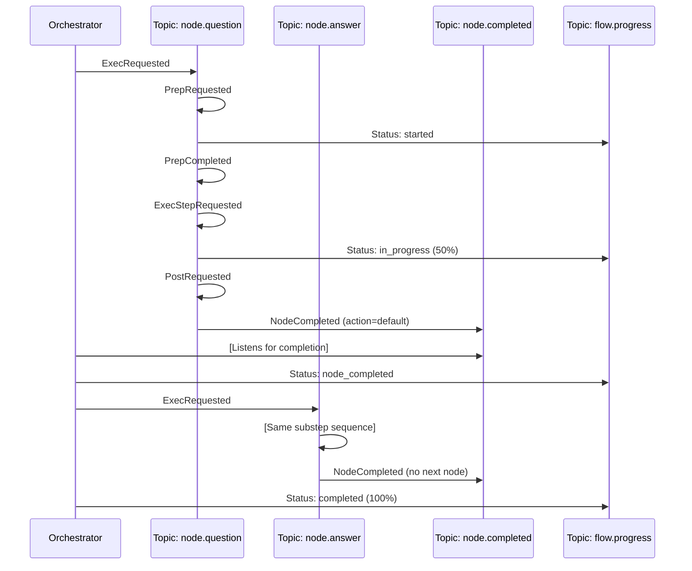

# Streamlined PocketFlow Architecture with Unified Node Topics

This document proposes a streamlined version of the PocketFlow architecture that uses a single topic per node type to handle all operations related to that node, including execution requests and substeps. This approach further simplifies the design while maintaining observability and flexibility.

## Core Design Principles

1. **Unified Node Topics**: Each node type has a single dedicated topic for all node-related messages
2. **Message Type Discrimination**: Messages on node topics are differentiated by message type field
3. **Universal Completion Topic**: A unified topic for all node completion events
4. **Flow Progress Topic**: A dedicated topic for flow progress updates
5. **Declarative Configuration**: Node workers declare their supported message types

## Topic Structure

The architecture uses the following streamlined topic structure:

| Topic Pattern | Purpose | Example |
|---------------|---------|---------|
| `node.{type}` | All messages related to a node type | `node.question` |
| `node.completed` | Signals completion of any node | `node.completed` |
| `flow.progress` | Provides flow progress updates | `flow.progress` |
| `flow.control` | Flow control messages (start, stop, pause) | `flow.control` |

## Message Structure

All messages include a common base structure:

```go
type BaseMessage struct {
    MessageType     string    `json:"message_type"`
    FlowExecutionID string    `json:"flow_execution_id"`
    NodeExecutionID string    `json:"node_execution_id,omitempty"`
    NodeType        string    `json:"node_type,omitempty"`
    NodeID          string    `json:"node_id,omitempty"`
    Timestamp       time.Time `json:"timestamp"`
}
```

### Node Message Types

Each node-specific message extends the base message structure. 

```go
// Core message types
const (
    // Message sent to request node execution
    MessageTypeExecRequested = "exec.requested"
    
    // Message sent to initiate the prep step
    MessageTypePrepRequested = "prep.requested"
    
    // Message sent after prep step is completed
    MessageTypePrepCompleted = "prep.completed"
    
    // Message sent to request the exec step
    MessageTypeExecStepRequested = "exec.step.requested"
    
    // Message sent to notify of exec step progress
    MessageTypeExecProgress = "exec.progress"
    
    // Message sent to request fallback execution
    MessageTypeExecFallbackRequested = "exec.fallback.requested"
    
    // Message sent to request the post step
    MessageTypePostRequested = "post.requested"
    
    // Message sent after the entire node execution is complete
    MessageTypeNodeCompleted = "node.completed"
    
    // Message sent after a node fails
    MessageTypeNodeFailed = "node.failed"
)
```

### Example: Node Execution Request Message

```go
type ExecRequestedMessage struct {
    BaseMessage
    Params map[string]interface{} `json:"params"`
}
```

### Example: Prep Completed Message

```go
type PrepCompletedMessage struct {
    BaseMessage
    PrepResultRef string `json:"prep_result_ref"`
}
```

### Example: Node Completion Message

```go
type NodeCompletedMessage struct {
    BaseMessage
    Result interface{} `json:"result,omitempty"`
    Action string      `json:"action"`
}
```

## Component Responsibilities

### 1. NodeWorker Interface

Node workers register to handle specific message types for their node type:

```go
type NodeWorker interface {
    // Get the node type this worker handles
    NodeType() string
    
    // Get the list of message types this worker handles
    SupportedMessageTypes() []string
    
    // Handle a message
    HandleMessage(msg *message.Message) error
}
```

### 2. Example Question Node Worker

```go
type QuestionNodeWorker struct {
    Publisher  EventPublisher
    StateStore StateStore
}

func (w *QuestionNodeWorker) NodeType() string {
    return "question"
}

func (w *QuestionNodeWorker) SupportedMessageTypes() []string {
    return []string{
        MessageTypeExecRequested,
        MessageTypePrepRequested,
        MessageTypeExecStepRequested,
        MessageTypePostRequested,
    }
}

func (w *QuestionNodeWorker) HandleMessage(msg *message.Message) error {
    // Extract base message to determine message type
    var base BaseMessage
    if err := json.Unmarshal(msg.Payload, &base); err != nil {
        return err
    }
    
    switch base.MessageType {
    case MessageTypeExecRequested:
        return w.handleExecRequested(msg)
    case MessageTypePrepRequested:
        return w.handlePrepRequested(msg)
    case MessageTypeExecStepRequested:
        return w.handleExecStepRequested(msg)
    case MessageTypePostRequested:
        return w.handlePostRequested(msg)
    default:
        return fmt.Errorf("unsupported message type: %s", base.MessageType)
    }
}

// Handle execution request - this can either do full node execution 
// or break it down into substeps
func (w *QuestionNodeWorker) handleExecRequested(msg *message.Message) error {
    var execReq ExecRequestedMessage
    if err := json.Unmarshal(msg.Payload, &execReq); err != nil {
        return err
    }
    
    // Option 1: Break down into substeps (prep -> exec -> post)
    // First, send prep request
    w.Publisher.Publish("node.question", PrepRequestedMessage{
        BaseMessage: BaseMessage{
            MessageType:     MessageTypePrepRequested,
            FlowExecutionID: execReq.FlowExecutionID,
            NodeExecutionID: execReq.NodeExecutionID,
            NodeType:        execReq.NodeType,
            NodeID:          execReq.NodeID,
            Timestamp:       time.Now(),
        },
        Params: execReq.Params,
    })
    
    // Option 2: Alternatively, execute the node directly
    // For simplicity, we'll focus on Option 1 in this example
    
    return nil
}

// Handle prep step request
func (w *QuestionNodeWorker) handlePrepRequested(msg *message.Message) error {
    var prepReq PrepRequestedMessage
    if err := json.Unmarshal(msg.Payload, &prepReq); err != nil {
        return err
    }
    
    // Get shared data
    sharedData, err := w.StateStore.GetSharedData(prepReq.FlowExecutionID)
    if err != nil {
        // Publish node failure
        w.Publisher.Publish("node.completed", NodeFailedMessage{
            BaseMessage: BaseMessage{
                MessageType:     MessageTypeNodeFailed,
                FlowExecutionID: prepReq.FlowExecutionID,
                NodeExecutionID: prepReq.NodeExecutionID,
                NodeType:        prepReq.NodeType,
                NodeID:          prepReq.NodeID,
                Timestamp:       time.Now(),
            },
            ErrorMessage: err.Error(),
        })
        return nil
    }
    
    // Store the prep result (using default question from params)
    question := prepReq.Params["question"].(string)
    prepResultRef := w.StateStore.StoreNodeResult(
        prepReq.FlowExecutionID, 
        prepReq.NodeExecutionID, 
        "prep", 
        question,
    )
    
    // Publish prep completion
    w.Publisher.Publish("node.question", PrepCompletedMessage{
        BaseMessage: BaseMessage{
            MessageType:     MessageTypePrepCompleted,
            FlowExecutionID: prepReq.FlowExecutionID,
            NodeExecutionID: prepReq.NodeExecutionID,
            NodeType:        prepReq.NodeType,
            NodeID:          prepReq.NodeID,
            Timestamp:       time.Now(),
        },
        PrepResultRef: prepResultRef,
    })
    
    // Now request the exec step
    w.Publisher.Publish("node.question", ExecStepRequestedMessage{
        BaseMessage: BaseMessage{
            MessageType:     MessageTypeExecStepRequested,
            FlowExecutionID: prepReq.FlowExecutionID,
            NodeExecutionID: prepReq.NodeExecutionID,
            NodeType:        prepReq.NodeType,
            NodeID:          prepReq.NodeID,
            Timestamp:       time.Now(),
        },
        PrepResultRef: prepResultRef,
    })
    
    return nil
}

// Handle exec step request
func (w *QuestionNodeWorker) handleExecStepRequested(msg *message.Message) error {
    var execReq ExecStepRequestedMessage
    if err := json.Unmarshal(msg.Payload, &execReq); err != nil {
        return err
    }
    
    // Get the prep result
    question, err := w.StateStore.GetNodeResult(execReq.PrepResultRef)
    if err != nil {
        // Publish node failure
        w.Publisher.Publish("node.completed", NodeFailedMessage{
            BaseMessage: BaseMessage{
                MessageType:     MessageTypeNodeFailed,
                FlowExecutionID: execReq.FlowExecutionID,
                NodeExecutionID: execReq.NodeExecutionID,
                NodeType:        execReq.NodeType,
                NodeID:          execReq.NodeID,
                Timestamp:       time.Now(),
            },
            ErrorMessage: err.Error(),
        })
        return nil
    }
    
    // Publish progress - started
    w.Publisher.Publish("flow.progress", FlowProgressMessage{
        BaseMessage: BaseMessage{
            MessageType:     "flow.progress",
            FlowExecutionID: execReq.FlowExecutionID,
            NodeExecutionID: execReq.NodeExecutionID,
            NodeType:        execReq.NodeType,
            NodeID:          execReq.NodeID,
            Timestamp:       time.Now(),
        },
        Status:          "started",
        Message:         "Asking question to user",
        ProgressPercent: 0,
    })
    
    // Execute the node logic - ask question
    fmt.Println(question)
    
    // Publish progress update
    w.Publisher.Publish("node.question", ExecProgressMessage{
        BaseMessage: BaseMessage{
            MessageType:     MessageTypeExecProgress,
            FlowExecutionID: execReq.FlowExecutionID,
            NodeExecutionID: execReq.NodeExecutionID, 
            NodeType:        execReq.NodeType,
            NodeID:          execReq.NodeID,
            Timestamp:       time.Now(),
        },
        ProgressPercent: 50,
        Message:         "Waiting for user input",
    })
    
    // Get user input
    var answer string
    fmt.Print("> ")
    fmt.Scanln(&answer)
    
    // Store the exec result
    execResultRef := w.StateStore.StoreNodeResult(
        execReq.FlowExecutionID,
        execReq.NodeExecutionID,
        "exec",
        answer,
    )
    
    // Request post processing
    w.Publisher.Publish("node.question", PostRequestedMessage{
        BaseMessage: BaseMessage{
            MessageType:     MessageTypePostRequested,
            FlowExecutionID: execReq.FlowExecutionID,
            NodeExecutionID: execReq.NodeExecutionID,
            NodeType:        execReq.NodeType,
            NodeID:          execReq.NodeID,
            Timestamp:       time.Now(),
        },
        PrepResultRef: execReq.PrepResultRef,
        ExecResultRef: execResultRef,
    })
    
    return nil
}

// Handle post step request
func (w *QuestionNodeWorker) handlePostRequested(msg *message.Message) error {
    var postReq PostRequestedMessage
    if err := json.Unmarshal(msg.Payload, &postReq); err != nil {
        return err
    }
    
    // Get the prep and exec results
    question, _ := w.StateStore.GetNodeResult(postReq.PrepResultRef)
    answer, _ := w.StateStore.GetNodeResult(postReq.ExecResultRef)
    
    // Prepare final result
    result := map[string]interface{}{
        "question":    question,
        "user_answer": answer,
    }
    
    // Publish node completion
    w.Publisher.Publish("node.completed", NodeCompletedMessage{
        BaseMessage: BaseMessage{
            MessageType:     MessageTypeNodeCompleted,
            FlowExecutionID: postReq.FlowExecutionID,
            NodeExecutionID: postReq.NodeExecutionID,
            NodeType:        postReq.NodeType,
            NodeID:          postReq.NodeID,
            Timestamp:       time.Now(),
        },
        Result: result,
        Action: "default", // Always use default action for this node
    })
    
    return nil
}
```

### 3. Flow Orchestrator

The Flow Orchestrator still monitors completions, but now has a more streamlined design:

```go
type FlowOrchestrator struct {
    Publisher     EventPublisher
    StateStore    StateStore
    FlowRegistry  FlowRegistry
    ActiveFlows   map[string]*FlowExecution
}

func (o *FlowOrchestrator) HandleFlowControlMessage(msg *message.Message) error {
    var base BaseMessage
    if err := json.Unmarshal(msg.Payload, &base); err != nil {
        return err
    }
    
    switch base.MessageType {
    case "flow.start.requested":
        return o.handleFlowStartRequested(msg)
    case "flow.pause.requested":
        return o.handleFlowPauseRequested(msg)
    case "flow.resume.requested":
        return o.handleFlowResumeRequested(msg)
    case "flow.stop.requested":
        return o.handleFlowStopRequested(msg)
    default:
        return fmt.Errorf("unsupported flow control message type: %s", base.MessageType)
    }
}

func (o *FlowOrchestrator) HandleNodeCompletionMessage(msg *message.Message) error {
    var base BaseMessage
    if err := json.Unmarshal(msg.Payload, &base); err != nil {
        return err
    }
    
    switch base.MessageType {
    case MessageTypeNodeCompleted:
        var completedMsg NodeCompletedMessage
        if err := json.Unmarshal(msg.Payload, &completedMsg); err != nil {
            return err
        }
        return o.handleNodeCompleted(completedMsg)
    
    case MessageTypeNodeFailed:
        var failedMsg NodeFailedMessage
        if err := json.Unmarshal(msg.Payload, &failedMsg); err != nil {
            return err
        }
        return o.handleNodeFailed(failedMsg)
    
    default:
        return fmt.Errorf("unsupported node completion message type: %s", base.MessageType)
    }
}

func (o *FlowOrchestrator) handleNodeCompleted(event NodeCompletedMessage) error {
    // Get flow execution
    flowExec, exists := o.ActiveFlows[event.FlowExecutionID]
    if !exists {
        return nil // Flow not active or unknown
    }
    
    // Update shared state with node result
    o.StateStore.UpdateSharedData(event.FlowExecutionID, event.NodeID, event.Result)
    
    // Publish progress event
    o.Publisher.Publish("flow.progress", FlowProgressMessage{
        BaseMessage: BaseMessage{
            MessageType:     "flow.progress",
            FlowExecutionID: event.FlowExecutionID,
            NodeExecutionID: event.NodeExecutionID,
            NodeType:        event.NodeType,
            NodeID:          event.NodeID,
            Timestamp:       time.Now(),
        },
        Status:          "node_completed",
        Message:         fmt.Sprintf("Node %s completed with action: %s", event.NodeID, event.Action),
        Action:          event.Action,
        ProgressPercent: calculateFlowProgress(flowExec, event.NodeID),
    })
    
    // Find next node based on the action
    nextNode := flowExec.Definition.GetNextNode(event.NodeType, event.Action)
    if nextNode != nil {
        // Execute next node
        nodeExecID := uuid.New().String()
        o.Publisher.Publish(
            fmt.Sprintf("node.%s", nextNode.Type), 
            ExecRequestedMessage{
                BaseMessage: BaseMessage{
                    MessageType:     MessageTypeExecRequested,
                    FlowExecutionID: event.FlowExecutionID,
                    NodeExecutionID: nodeExecID,
                    NodeType:        nextNode.Type,
                    NodeID:          nextNode.ID,
                    Timestamp:       time.Now(),
                },
                Params: nextNode.Params,
            },
        )
        return nil
    }
    
    // No next node, flow is complete
    o.Publisher.Publish("flow.control", FlowCompletedMessage{
        BaseMessage: BaseMessage{
            MessageType:     "flow.completed",
            FlowExecutionID: event.FlowExecutionID,
            Timestamp:       time.Now(),
        },
        FinalAction: event.Action,
    })
    
    // Publish final progress
    o.Publisher.Publish("flow.progress", FlowProgressMessage{
        BaseMessage: BaseMessage{
            MessageType:     "flow.progress",
            FlowExecutionID: event.FlowExecutionID,
            Timestamp:       time.Now(),
        },
        Status:          "completed",
        Message:         "Flow completed successfully",
        ProgressPercent: 100,
    })
    
    // Clean up
    delete(o.ActiveFlows, event.FlowExecutionID)
    
    return nil
}
```

### 4. Router Setup

```go
func SetupRouter(router *message.Router, orchestrator *FlowOrchestrator, nodeWorkers []NodeWorker) {
    // Add middleware
    router.AddMiddleware(
        middleware.CorrelationID,
        middleware.Recoverer,
    )
    
    // Set up node workers
    for _, worker := range nodeWorkers {
        // Register handler for the node's topic
        nodeTopic := fmt.Sprintf("node.%s", worker.NodeType())
        
        router.AddNoPublisherHandler(
            fmt.Sprintf("%s_handler", worker.NodeType()),
            nodeTopic,
            pubSub,
            worker.HandleMessage,
        )
    }
    
    // Set up handler for node.completed
    router.AddNoPublisherHandler(
        "node_completion_handler",
        "node.completed",
        pubSub,
        orchestrator.HandleNodeCompletionMessage,
    )
    
    // Set up handler for flow.control
    router.AddNoPublisherHandler(
        "flow_control_handler",
        "flow.control",
        pubSub,
        orchestrator.HandleFlowControlMessage,
    )
    
    // Set up handler for flow.progress (optional)
    router.AddNoPublisherHandler(
        "flow_progress_handler",
        "flow.progress",
        pubSub,
        func(msg *message.Message) error {
            var progressMsg FlowProgressMessage
            if err := json.Unmarshal(msg.Payload, &progressMsg); err != nil {
                return err
            }
            
            // Log progress updates
            log.Printf("Flow progress [%s]: %s - %s (%.1f%%)",
                progressMsg.FlowExecutionID,
                progressMsg.Status,
                progressMsg.Message,
                progressMsg.ProgressPercent,
            )
            
            return nil
        },
    )
}
```

## Complete Example: Initializing and Starting a Flow

```go
func main() {
    // Initialize Watermill components
    logger := watermill.NewStdLogger(false, false)
    pubSub := gochannel.NewGoChannel(gochannel.Config{}, logger)
    router, _ := message.NewRouter(message.RouterConfig{}, logger)
    
    // Initialize state store
    stateStore := NewInMemoryStateStore()
    
    // Initialize flow registry
    flowRegistry := NewInMemoryFlowRegistry()
    
    // Initialize publisher
    publisher := NewWatermillPublisher(pubSub)
    
    // Initialize orchestrator
    orchestrator := &FlowOrchestrator{
        Publisher:    publisher,
        StateStore:   stateStore,
        FlowRegistry: flowRegistry,
        ActiveFlows:  make(map[string]*FlowExecution),
    }
    
    // Create node workers
    questionWorker := &QuestionNodeWorker{
        Publisher:  publisher,
        StateStore: stateStore,
    }
    
    answerWorker := &AnswerNodeWorker{
        Publisher:  publisher,
        StateStore: stateStore,
        LLMClient:  NewMockLLMClient(),
    }
    
    // Register node workers
    nodeWorkers := []NodeWorker{
        questionWorker,
        answerWorker,
    }
    
    // Set up router
    SetupRouter(router, orchestrator, nodeWorkers)
    
    // Define flow
    questionAnswerFlow := &FlowDefinition{
        ID:            "question_answer_flow",
        Name:          "Question Answer Flow",
        StartNodeType: "question",
        StartNodeID:   "question-1",
        StartNodeParams: map[string]interface{}{
            "question": "What would you like to know about?",
        },
        Nodes: map[string]NodeDefinition{
            "question-1": {
                ID:     "question-1",
                Type:   "question",
                Params: map[string]interface{}{},
            },
            "answer-1": {
                ID:     "answer-1",
                Type:   "answer",
                Params: map[string]interface{}{},
            },
        },
        Transitions: map[string]map[string]TransitionDefinition{
            "question-1": {
                "default": {
                    Action:   "default",
                    ToNodeID: "answer-1",
                },
            },
        },
    }
    
    // Register flow
    flowRegistry.RegisterFlow(questionAnswerFlow.ID, questionAnswerFlow)
    
    // Start the router
    go func() {
        if err := router.Run(context.Background()); err != nil {
            panic(err)
        }
    }()
    
    // Start the flow
    flowExecutionID := uuid.New().String()
    publisher.Publish("flow.control", FlowStartRequestedMessage{
        BaseMessage: BaseMessage{
            MessageType:     "flow.start.requested",
            FlowExecutionID: flowExecutionID,
            Timestamp:       time.Now(),
        },
        FlowDefinitionID: questionAnswerFlow.ID,
        InitialSharedData: map[string]interface{}{
            "started_at": time.Now().Format(time.RFC3339),
        },
    })
    
    // Wait for user to exit
    fmt.Println("Press Enter to exit")
    fmt.Scanln()
}
```

## Message Flow Diagram

The following diagram illustrates how messages flow through the system:



## Benefits of This Architecture

1. **Simplified Routing**: Each node type has a single topic, simplifying topic management
2. **Self-Contained Node Logic**: Nodes manage their own substeps on their own topic
3. **Flexible Execution Models**: Nodes can choose their own execution pattern (atomic or broken down)
4. **Distributed Execution**: Different node types can run on separate servers
5. **Granular Progress Reporting**: Internal node substeps provide detailed progress
6. **Reduced Topic Count**: Fewer topics to monitor and manage
7. **Explicit Message Types**: Clear message typing makes debugging easier

## Comparison with Previous Architecture

| Feature | Unified Node Topics | Multiple Topic Types | CQRS-based |
|---------|---------------------|----------------------|------------|
| Topic Count | Lower | Higher | Highest |
| Type Safety | Good | Basic | Excellent |
| Message Structure | Type-based | Topic-based | Command/Event |
| Internal Node Logic | Self-managed | Orchestrator-driven | Command Handlers |
| Observability | Excellent | Good | Good |
| Development Speed | Fast | Medium | Slow |
| Scalability | Excellent | Good | Excellent |

## Conclusion

The unified node topics architecture offers a more streamlined approach to PocketFlow's event-driven design. By consolidating all node-related messages on a single topic per node type, it reduces the complexity of topic management while still maintaining the flexibility and observability of the system. Node workers can manage their own execution lifecycle, breaking down execution into substeps when needed, without requiring the orchestrator to be aware of these internal details.

This approach enables a cleaner separation of concerns, where:
- The orchestrator only needs to know about starting nodes and handling completions
- Nodes can decide their own execution strategy
- Progress reporting can be granular but standardized

The result is a simpler, more maintainable system that's still capable of handling complex flows with detailed observability. 