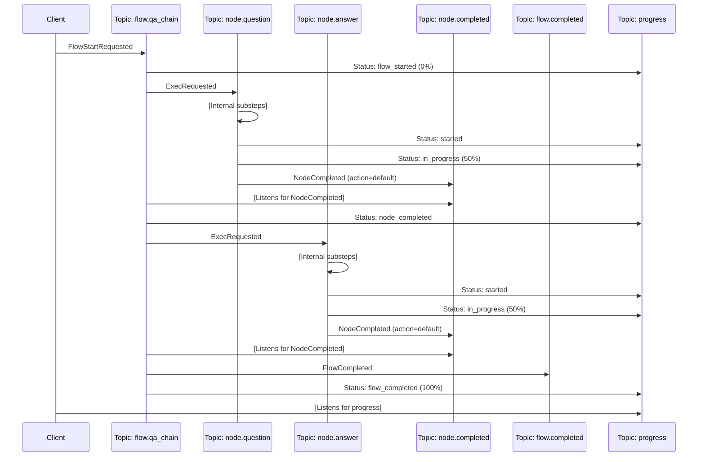

# Symmetric Flow and Node Topic Architecture for PocketFlow

This document proposes a fully symmetric architecture for PocketFlow where both nodes and flows have their own dedicated topics. This creates a clean, consistent design pattern where different flow types (just like node types) can be managed independently with maximum flexibility and scalability.

## Core Design Principles

1. **Symmetric Topic Structure**: Nodes and flows both have their own dedicated topics
2. **Flow-Type Specific Topics**: Each flow type has its own dedicated topic (`flow.{flowType}`)
3. **Universal Completion Topics**: Unified topics for node and flow completions
4. **Type-Based Message Discrimination**: Messages differentiated by message type fields
5. **Declarative Configuration**: Node and flow workers declare their supported message types
6. **Builder Pattern API**: Flow structure defined using a declarative builder pattern

## Topic Structure

The architecture uses the following symmetric topic structure:

| Topic Pattern | Purpose | Example |
|---------------|---------|---------|
| `node.{type}` | All messages related to a node type | `node.question` |
| `node.completed` | Signals completion of any node | `node.completed` |
| `flow.{type}` | All messages related to a flow type | `flow.qa_chain` |
| `flow.completed` | Signals completion of any flow | `flow.completed` |
| `progress` | All progress update messages | `progress` |

## Message Structure

All messages extend a common base structure:

```go
type BaseMessage struct {
    MessageType     string    `json:"message_type"`
    FlowExecutionID string    `json:"flow_execution_id"`
    NodeExecutionID string    `json:"node_execution_id,omitempty"`
    Timestamp       time.Time `json:"timestamp"`
}
```

### Flow Message Types

Similarly to node messages, flow messages are differentiated by type:

```go
// Core flow message types
const (
    // Message sent to request flow start
    MessageTypeFlowStartRequested = "flow.start.requested"
    
    // Message sent after flow initialization
    MessageTypeFlowInitialized = "flow.initialized"
    
    // Message sent to request flow pause
    MessageTypeFlowPauseRequested = "flow.pause.requested"
    
    // Message sent to confirm flow is paused
    MessageTypeFlowPaused = "flow.paused"
    
    // Message sent to request flow resume
    MessageTypeFlowResumeRequested = "flow.resume.requested"
    
    // Message sent to request flow cancellation
    MessageTypeFlowCancelRequested = "flow.cancel.requested"
    
    // Message sent after flow successfully completes
    MessageTypeFlowCompleted = "flow.completed"
    
    // Message sent after flow fails
    MessageTypeFlowFailed = "flow.failed"
)
```

### Example: Flow Start Request Message

```go
type FlowStartRequestedMessage struct {
    BaseMessage
    FlowType          string                 `json:"flow_type"`
    FlowDefinitionID  string                 `json:"flow_definition_id"`
    InitialSharedData map[string]interface{} `json:"initial_shared_data"`
}
```

### Example: Flow Completion Message

```go
type FlowCompletedMessage struct {
    BaseMessage
    FlowType    string        `json:"flow_type"`
    FinalAction string        `json:"final_action"`
    FinalResult interface{}   `json:"final_result,omitempty"`
    ExecutionMs int64         `json:"execution_ms"`
}
```

## Flow Definition Using Declarative Builder API

The architecture uses a declarative builder pattern to construct flows. This provides an expressive, type-safe way to define node relationships and transitions.

### Flow Builder Interface

```go
// FlowBuilder interface provides a fluent API for building flows
type FlowBuilder interface {
    // Begin sets the starting node for the flow
    Begin(node Node) FlowBuilder
    
    // Then creates a default transition from the previous node
    Then(node Node) FlowBuilder
    
    // On defines an action-based transition from the previous node
    On(action string) TransitionBuilder
    
    // From switches the source node for subsequent transitions
    From(node Node) FlowBuilder
    
    // Build finalizes the flow definition
    Build() Flow
}

// TransitionBuilder defines what happens for a specific action
type TransitionBuilder interface {
    // Then sets the destination node for this action
    Then(node Node) FlowBuilder
}
```

### Example: Defining a QA Flow

```go
// Define nodes
questionNode := NewNode("question", QuestionNodeConfig{})
answerNode := NewNode("answer", AnswerNodeConfig{})

// Define flow using builder pattern
qaFlow := NewFlowBuilder().
    Begin(questionNode).
    Then(answerNode).
    Build()
```

### Example: Expense Approval Flow with Branching

```go
// Define nodes
reviewNode := NewNode("review", ReviewConfig{})
paymentNode := NewNode("payment", PaymentConfig{})
reviseNode := NewNode("revise", ReviseConfig{})
finishNode := NewNode("finish", FinishConfig{})

// Build flow with branches
expenseFlow := NewFlowBuilder().
    Begin(reviewNode).
    On("approved").Then(paymentNode).
    On("needs_revision").Then(reviseNode).
    On("rejected").Then(finishNode).
    From(reviseNode).Then(reviewNode). // Loop back
    From(paymentNode).Then(finishNode).
    Build()
```

## Component Responsibilities

### 1. Generic Flow Orchestrator

The flow orchestrator is now completely generic, handling all flow types through the same interface. It works based on the declarative flow definition provided by the builder pattern.

```go
type FlowOrchestrator struct {
    Publisher  EventPublisher
    StateStore StateStore
    Registry   FlowRegistry
}

// RegisterFlow registers a flow definition with the orchestrator
func (o *FlowOrchestrator) RegisterFlow(flowDef Flow) {
    o.Registry.RegisterFlow(flowDef.ID(), flowDef)
}

// GetNextNode determines the next node to execute based on completed node and action
func (o *FlowOrchestrator) GetNextNode(flow Flow, currentNodeID, action string) (Node, bool) {
    return flow.GetNextNode(currentNodeID, action)
}

// StartFlow initiates flow execution with the flow definition from registry
func (o *FlowOrchestrator) StartFlow(flowType, flowID string, initialData map[string]interface{}) string {
    flowExecutionID := uuid.New().String()
    
    o.Publisher.Publish(
        fmt.Sprintf("flow.%s", flowType),
        FlowStartRequestedMessage{
            BaseMessage: BaseMessage{
                MessageType:     MessageTypeFlowStartRequested,
                FlowExecutionID: flowExecutionID,
                Timestamp:       time.Now(),
            },
            FlowType:          flowType,
            FlowDefinitionID:  flowID,
            InitialSharedData: initialData,
        },
    )
    
    return flowExecutionID
}
```

### 2. Generic Flow Worker

The flow worker processes messages for a specific flow type, but relies on the generic flow definition from the builder:

```go
type GenericFlowWorker struct {
    FlowType   string
    Publisher  EventPublisher
    StateStore StateStore
    Registry   FlowRegistry
    Orchestrator *FlowOrchestrator
}

func (w *GenericFlowWorker) FlowType() string {
    return w.FlowType
}

func (w *GenericFlowWorker) SupportedMessageTypes() []string {
    return []string{
        MessageTypeFlowStartRequested,
        MessageTypeFlowInitialized,
        MessageTypeFlowPauseRequested,
        MessageTypeFlowResumeRequested,
        MessageTypeFlowCancelRequested,
    }
}

func (w *GenericFlowWorker) HandleMessage(msg *message.Message) error {
    // Extract base message to determine message type
    var base BaseMessage
    if err := json.Unmarshal(msg.Payload, &base); err != nil {
        return err
    }
    
    switch base.MessageType {
    case MessageTypeFlowStartRequested:
        return w.handleFlowStartRequested(msg)
    // Handle other message types...
    default:
        return fmt.Errorf("unsupported message type: %s", base.MessageType)
    }
}

// HandleNodeCompletedMessage processes node completion events to advance the flow
func (w *GenericFlowWorker) HandleNodeCompletedMessage(msg *message.Message) error {
    var completed NodeCompletedMessage
    if err := json.Unmarshal(msg.Payload, &completed); err != nil {
        return err
    }
    
    // Get flow definition from registry
    flowDef, err := w.Registry.GetFlowByExecutionID(completed.FlowExecutionID)
    if err != nil {
        return err
    }
    
    // Update shared data with node result
    w.StateStore.UpdateSharedData(completed.FlowExecutionID, completed.NodeID, completed.Result)
    
    // Find next node based on the action using the flow definition
    nextNode, exists := w.Orchestrator.GetNextNode(flowDef, completed.NodeID, completed.Action)
    if !exists || nextNode == nil {
        // Flow is complete
        w.publishFlowCompletion(completed.FlowExecutionID, flowDef.Type(), completed.Action)
        return nil
    }
    
    // Start the next node
    nodeExecID := uuid.New().String()
    w.Publisher.Publish(
        fmt.Sprintf("node.%s", nextNode.Type()),
        ExecRequestedMessage{
            BaseMessage: BaseMessage{
                MessageType:     MessageTypeExecRequested,
                FlowExecutionID: completed.FlowExecutionID,
                NodeExecutionID: nodeExecID,
                Timestamp:       time.Now(),
            },
            NodeType: nextNode.Type(),
            NodeID:   nextNode.ID(),
            Params:   nextNode.Params(),
        },
    )
    
    return nil
}
```

## Example: Defining and Registering Flows

```go
func main() {
    // Initialize system components
    publisher := NewWatermillPublisher(pubSub)
    stateStore := NewInMemoryStateStore()
    flowRegistry := NewInMemoryFlowRegistry()
    
    // Create orchestrator
    orchestrator := &FlowOrchestrator{
        Publisher:  publisher,
        StateStore: stateStore,
        Registry:   flowRegistry,
    }
    
    // Create node workers
    questionWorker := NewQuestionNodeWorker(publisher, stateStore)
    answerWorker := NewAnswerNodeWorker(publisher, stateStore, llmClient)
    
    // Create nodes
    questionNode := NewNode("question", QuestionNodeConfig{})
    answerNode := NewNode("answer", AnswerNodeConfig{})
    
    // Define QA flow using builder pattern
    qaFlow := NewFlowBuilder().
        Begin(questionNode).
        Then(answerNode).
        Build()
    
    // Register flow with orchestrator
    orchestrator.RegisterFlow(qaFlow)
    
    // Create flow worker for QA flow type
    qaFlowWorker := &GenericFlowWorker{
        FlowType:     "qa_chain",
        Publisher:    publisher,
        StateStore:   stateStore,
        Registry:     flowRegistry,
        Orchestrator: orchestrator,
    }
    
    // Set up router
    SetupRouter(router, []NodeWorker{questionWorker, answerWorker}, []FlowWorker{qaFlowWorker})
    
    // Start the QA flow
    orchestrator.StartFlow("qa_chain", qaFlow.ID(), map[string]interface{}{
        "started_at": time.Now(),
    })
}
```

## Defining More Complex Flows

### Example: Multi-step Conversation Flow

```go
// Define nodes
greetingNode := NewNode("greeting", GreetingConfig{})
userInputNode := NewNode("user_input", UserInputConfig{})
intentNode := NewNode("intent_classifier", IntentConfig{})
weatherNode := NewNode("weather_service", WeatherConfig{})
generalQANode := NewNode("general_qa", GeneralQAConfig{})
farewell := NewNode("farewell", FarewellConfig{})

// Define conversation flow
conversationFlow := NewFlowBuilder().
    Begin(greetingNode).
    Then(userInputNode).
    Then(intentNode).
    On("weather").Then(weatherNode).Then(userInputNode).
    On("general_question").Then(generalQANode).Then(userInputNode).
    On("goodbye").Then(farewell).
    Build()

// Register the flow
orchestrator.RegisterFlow(conversationFlow)

// Create flow worker
conversationFlowWorker := &GenericFlowWorker{
    FlowType:     "conversation",
    Publisher:    publisher,
    StateStore:   stateStore,
    Registry:     flowRegistry,
    Orchestrator: orchestrator,
}
```

### Example: Nested Flows

Using the builder pattern, we can compose flows to create more complex workflows:

```go
// Define sub-flows
paymentFlow := NewFlowBuilder().
    Begin(validatePaymentNode).
    Then(processPaymentNode).
    Then(paymentConfirmationNode).
    Build()

inventoryFlow := NewFlowBuilder().
    Begin(checkStockNode).
    Then(reserveItemsNode).
    Then(updateInventoryNode).
    Build()

shippingFlow := NewFlowBuilder().
    Begin(createLabelNode).
    Then(assignCarrierNode).
    Then(schedulePickupNode).
    Build()

// Combine into order pipeline
orderPipeline := NewFlowBuilder().
    Begin(paymentFlow).  // Using a flow as a node
    Then(inventoryFlow).
    Then(shippingFlow).
    Build()

// Register the flow
orchestrator.RegisterFlow(orderPipeline)
```

## Router Setup

```go
func SetupRouter(router *message.Router, nodeWorkers []NodeWorker, flowWorkers []FlowWorker) {
    // Add middleware
    router.AddMiddleware(
        middleware.CorrelationID,
        middleware.Recoverer,
    )
    
    // Set up node workers
    for _, worker := range nodeWorkers {
        nodeTopic := fmt.Sprintf("node.%s", worker.NodeType())
        
        router.AddNoPublisherHandler(
            fmt.Sprintf("%s_handler", worker.NodeType()),
            nodeTopic,
            pubSub,
            worker.HandleMessage,
        )
    }
    
    // Set up flow workers
    for _, worker := range flowWorkers {
        flowTopic := fmt.Sprintf("flow.%s", worker.FlowType())
        
        // Handler for flow-specific messages
        router.AddNoPublisherHandler(
            fmt.Sprintf("%s_handler", worker.FlowType()),
            flowTopic,
            pubSub,
            worker.HandleMessage,
        )
        
        // Handler for node completions (for flow progression)
        router.AddNoPublisherHandler(
            fmt.Sprintf("%s_node_completion_handler", worker.FlowType()),
            "node.completed",
            pubSub,
            worker.HandleNodeCompletedMessage,
        )
    }
    
    // Set up common handlers (same as before)
    // ...
}
```

## Flow Persistence and Visualization

### Storing Flow Definitions

The flow registry persists flow definitions for reuse:

```go
type FlowRegistry interface {
    // Register a flow definition
    RegisterFlow(flowID string, flow Flow) error
    
    // Get a flow definition by ID
    GetFlow(flowID string) (Flow, error)
    
    // Get a flow definition by execution ID
    GetFlowByExecutionID(executionID string) (Flow, error)
}
```

### Flow Visualization

The flow definition supports visualization for debugging and documentation:

```go
// Generate a mermaid diagram for the flow
func (flow *flowDefinition) Visualize() string {
    var sb strings.Builder
    
    sb.WriteString("flowchart TD\n")
    
    // Add nodes
    for _, node := range flow.nodes {
        sb.WriteString(fmt.Sprintf("    %s[%s]\n", node.ID(), node.Name()))
    }
    
    // Add transitions
    for sourceID, actions := range flow.transitions {
        for action, targetID := range actions {
            label := action
            if label == "default" {
                label = ""
            } else {
                label = "|" + label + "|"
            }
            
            sb.WriteString(fmt.Sprintf("    %s -->%s %s\n", 
                sourceID, label, targetID))
        }
    }
    
    return sb.String()
}
```

## Message Flow Diagram

The following diagram illustrates the complete message flow through the system:



## Benefits of This Architecture

1. **Flow-Type Specific Logic**: Each flow type can have its own unique processing logic
2. **Symmetric Design**: Nodes and flows follow the same pattern, simplifying the mental model
3. **Reduced Central Orchestrator**: Flow logic is distributed to specialized flow workers
4. **Flexibility**: New flow types can be added without changing the core architecture
5. **Isolation**: Flow types can be deployed and scaled independently
6. **Extensibility**: Flow workers can be extended with specialized capabilities
7. **Clean Message Routing**: Messages are routed to exactly where they're needed
8. **Declarative Definition**: Flows are defined using a readable, type-safe builder pattern
9. **Composability**: Flows can be nested and reused as building blocks

## Comparison with Previous Architectures

| Feature | Symmetric Architecture with Builder | Symmetric Architecture | Unified Node Topics | Multiple Topic Types | CQRS-based |
|---------|-------------------------------------|------------------------|---------------------|----------------------|------------|
| Flow Type Support | Excellent | Excellent | Limited | Limited | Good |
| Topic Count | Medium | Medium | Low | High | High |
| Flow Extensibility | Excellent | Excellent | Limited | Limited | Good |
| Message Structure | Type-based | Type-based | Type-based | Topic-based | Command/Event |
| Observability | Excellent | Excellent | Excellent | Good | Good |
| Development Speed | Fast | Medium | Fast | Medium | Slow |
| Scalability | Excellent | Excellent | Good | Good | Excellent |
| Testability | Excellent | Good | Good | Medium | Good |
| Flow Visualization | Built-in | Limited | Limited | Limited | Limited |

## Conclusion

The symmetric flow and node topic architecture with declarative builder pattern provides an expressive, flexible, and type-safe approach to creating and managing workflows in PocketFlow. 

The builder pattern makes flow definitions intuitive and readable, while the symmetric topic structure ensures flows and nodes follow consistent patterns. This approach is particularly well-suited for systems with diverse flow types, each with their own business logic and requirements.

Key advantages include:

1. **Declarative Configuration**: Flows are defined using an expressive builder API
2. **Composability**: Flows can be nested within other flows for complex workflows
3. **Type Safety**: Leverages Go's type system for better error detection
4. **Consistent Design**: Nodes and flows follow similar patterns
5. **Visualization**: Built-in support for flow visualization

For complex applications with multiple flow types and node types, this architecture provides a solid foundation that can grow and adapt as requirements evolve. 