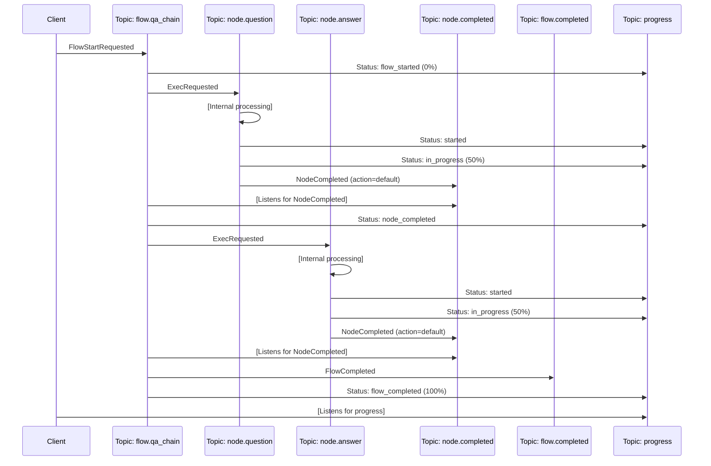

# PocketFlow Go Implementation: Symmetric Flow and Node Architecture

This document provides a comprehensive guide to the Go implementation of PocketFlow, based on the symmetric flow and node architecture. It's designed to help new developers understand the architecture, components, and patterns used in the system, with practical examples for building your own agents and workflows.

## Introduction to PocketFlow Go Architecture

At its core, PocketFlow is a lightweight yet powerful framework for building complex LLM-powered applications using a graph-based workflow approach. The Go implementation follows an event-driven architecture where:

- **Nodes** represent individual task processors (like questioning a user or calling an LLM)
- **Flows** connect nodes together in a flexible, declarative way
- **Workers** handle the execution of nodes and flows
- **Messages** communicate between components using a publish-subscribe pattern
- **Topics** route messages to the appropriate handlers

This architecture provides several key advantages:

- **Decoupling**: Business logic (flows) is separated from execution logic (workers)
- **Flexibility**: Flows can be defined, modified, and visualized declaratively
- **Extensibility**: New node and flow types can be added without changing the core system
- **Observability**: Progress updates and execution status are built into the framework
- **Scalability**: Components can be distributed and scaled independently

## 1. Core Interfaces & Components

### 1.1 Primary Interfaces

The architecture is built around several key interfaces that form the foundation of the system. Understanding these interfaces is crucial for working with PocketFlow effectively.

#### Node Interface

The `Node` interface represents a single processing unit within a flow. Each node has a unique identity, a specific type, and optional parameters:

```go
// Node interface represents a node in a flow
type Node interface {
    // Get the unique ID of this node
    ID() string
    // Get the type of this node
    Type() string
    // Get the display name of this node
    Name() string
    // Get the parameters for this node
    Params() map[string]interface{}
}
```

When implementing your own node types, you'll typically:
1. Define a node type (e.g., "question", "llm_call", "data_retrieval")
2. Specify parameters needed by the node worker (e.g., prompt templates, API settings)
3. Create an instance using the `NewNode` factory function

Nodes are declarative definitions - they define "what" should be processed, but not "how". The actual processing logic is implemented in `NodeWorker` implementations.

#### Flow Interface

The `Flow` interface represents a connected graph of nodes with defined transitions between them:

```go
// Flow interface represents a flow definition
type Flow interface {
    // Get the unique ID of this flow
    ID() string
    // Get the type of this flow
    Type() string
    // Get the name of this flow
    Name() string
    // Get the starting node of this flow
    StartNode() Node
    // Get all nodes in this flow
    Nodes() map[string]Node
    // Get the next node based on current node and action
    GetNextNode(currentNodeID, action string) (Node, bool)
    // Generate a visualization of this flow
    Visualize() string
}
```

Flows define how nodes are connected and the possible paths through the workflow. The key method here is `GetNextNode`, which determines the next node to execute based on the current node and the action it returned.

Rather than implementing this interface directly, you'll typically use the `FlowBuilder` to create flows in a declarative way.

#### Worker Interfaces

Workers are responsible for the actual execution of nodes and flows:

```go
// NodeWorker interface for node workers
type NodeWorker interface {
    // Get the type of node this worker handles
    NodeType() string
    // Get the list of message types this worker can handle
    SupportedMessageTypes() []string
    // Handle a message
    HandleMessage(msg interface{}) error
    // Legacy methods
    HandlePrepRequested(event NodePrepRequested)
    HandleExecRequested(event NodeExecRequested)
    HandlePostRequested(event NodePostRequested)
    HandleExecFailed(event NodeExecFailed)
}

// FlowWorker interface for flow workers
type FlowWorker interface {
    // Get the type of flow this worker handles
    FlowType() string
    // Get the list of message types this worker can handle
    SupportedMessageTypes() []string
    // Handle a message
    HandleMessage(msg interface{}) error
    // Handle a node completion message
    HandleNodeCompletedMessage(msg interface{}) error
}
```

When building a new PocketFlow application, you'll:
1. Implement `NodeWorker` for each node type (e.g., `QuestionNodeWorker`, `LLMNodeWorker`)
2. Register these workers with the event router
3. Use the generic `GenericFlowWorker` for most flow types (unless you need custom flow logic)

### 1.2 Builder Interfaces

One of the most powerful aspects of PocketFlow is the declarative builder pattern, which allows you to define flows in a fluent, readable manner:

```go
// FlowBuilder interface provides a fluent API for building flows
type FlowBuilder interface {
    // Begin sets the starting node for the flow
    Begin(node Node) FlowBuilder
    // Then creates a default transition from the previous node
    Then(node Node) FlowBuilder
    // On defines an action-based transition from the previous node
    On(action string) TransitionBuilder
    // From switches the source node for subsequent transitions
    From(node Node) FlowBuilder
    // Build finalizes the flow definition
    Build() Flow
}

// TransitionBuilder defines what happens for a specific action
type TransitionBuilder interface {
    // Then sets the destination node for this action
    Then(node Node) FlowBuilder
}
```

This builder pattern enables a clean, readable syntax for defining even complex flows with branching and loops. The fluent API makes it simple to understand the flow structure at a glance, and the resulting flow definition can be visualized and executed consistently.

### 1.3 Infrastructure Interfaces

The system relies on several infrastructure interfaces that provide essential services:

```go
// EventPublisher interface for publishing events
type EventPublisher interface {
    Publish(topic string, event interface{}) error
}

// EventSubscriber interface for subscribing to events
type EventSubscriber interface {
    Subscribe(topic string, handler func([]byte)) error
}

// StateStore interface for storing and retrieving state
type StateStore interface {
    // Store shared data for a flow execution
    StoreSharedData(flowExecutionID string, data map[string]interface{}) error
    // Get shared data for a flow execution
    GetSharedData(flowExecutionID string) (map[string]interface{}, error)
    // Store the result of a node's prep/exec/post step
    StoreNodeResult(nodeExecutionID string, stepType string, result interface{}) (string, error)
    // Get a stored result by reference
    GetNodeResult(resultRef string) (interface{}, error)
    // Store flow definition
    StoreFlowDefinition(flowID string, definition Flow) error
    // Get flow definition
    GetFlowDefinition(flowID string) (Flow, error)
    // Get flow definition by execution ID
    GetFlowDefinitionByExecutionID(executionID string) (Flow, error)
    // Store a mapping between execution ID and definition ID
    StoreFlowExecution(executionID string, definitionID string) error
    // Update shared data with node result
    UpdateSharedData(flowExecutionID string, nodeID string, result interface{}) error
}

// FlowRegistry interface for managing flow definitions
type FlowRegistry interface {
    // Get a flow definition by ID
    GetFlow(flowID string) (Flow, error)
    // Get a flow definition by execution ID
    GetFlowByExecutionID(executionID string) (Flow, error)
    // Register a flow definition
    RegisterFlow(flowID string, flow Flow) error
    // Legacy methods
    GetFlowDefinition(flowID string) (*FlowDefinition, error)
}
```

These interfaces provide core functionality:

- **Event messaging**: `EventPublisher` and `EventSubscriber` enable the pub-sub communication pattern
- **State management**: `StateStore` provides persistence for flow execution data
- **Flow registry**: `FlowRegistry` manages flow definitions

The PocketFlow implementation provides default implementations for all these interfaces, but they can be replaced with custom implementations if needed (e.g., using different persistence mechanisms or messaging systems).

## 2. Message Structure and Types

### 2.1 The Common Message Foundation

The PocketFlow messaging system is built on a unified message structure that enables consistent handling and routing of events throughout the system. All messages extend a common base structure:

```go
// BaseMessage is the common structure for all messages
type BaseMessage struct {
    MessageType     string    `json:"message_type"`                // Type of message
    FlowExecutionID string    `json:"flow_execution_id"`           // ID of the overall flow execution
    NodeExecutionID string    `json:"node_execution_id,omitempty"` // ID of this specific node execution (if applicable)
    Timestamp       time.Time `json:"timestamp"`                   // When this message was created
}
```

This base structure provides:

- **Message identification**: The `MessageType` field identifies the purpose of the message
- **Flow context**: The `FlowExecutionID` links the message to a specific flow execution instance
- **Node context**: The optional `NodeExecutionID` links the message to a specific node execution
- **Timing information**: The `Timestamp` records when the message was created

Using a common base structure enables generic message handling and routing, while specialized message types can add custom fields for specific purposes.

### 2.2 Message Type Constants

The system defines a set of well-known message types as constants, organized by their purpose:

```go
// Flow message types
const (
    // Message sent to request flow start
    MessageTypeFlowStartRequested = "flow.start.requested"
    // Message sent after flow initialization
    MessageTypeFlowInitialized = "flow.initialized"
    // Message sent to request flow pause
    MessageTypeFlowPauseRequested = "flow.pause.requested"
    // Message sent to confirm flow is paused
    MessageTypeFlowPaused = "flow.paused"
    // Message sent to request flow resume
    MessageTypeFlowResumeRequested = "flow.resume.requested"
    // Message sent to request flow cancellation
    MessageTypeFlowCancelRequested = "flow.cancel.requested"
    // Message sent after flow successfully completes
    MessageTypeFlowCompleted = "flow.completed"
    // Message sent after flow fails
    MessageTypeFlowFailed = "flow.failed"
)

// Node message types
const (
    // Message sent to request node execution
    MessageTypeExecRequested = "node.exec.requested"
    // Message sent after node completes execution
    MessageTypeNodeCompleted = "node.completed"
    // Message sent after node fails execution
    MessageTypeExecFailed = "node.exec.failed"
)

// Progress message types
const (
    // Message for progress updates
    MessageTypeProgressUpdate = "progress.update"
)
```

These constants enforce consistency in message naming and categorization. The naming convention follows a pattern of `{entity}.{action}.{state}` which makes it easy to understand the purpose of each message type.

### 2.3 Specialized Message Types

#### Flow Control Messages

Flow control messages manage the lifecycle of a flow execution:

```go
// Message sent to request flow start
type FlowStartRequestedMessage struct {
    BaseMessage
    FlowType          string                 `json:"flow_type"`
    FlowDefinitionID  string                 `json:"flow_definition_id"`
    InitialSharedData map[string]interface{} `json:"initial_shared_data"`
}

// Message sent after flow initialization
type FlowInitializedMessage struct {
    BaseMessage
    FlowType         string `json:"flow_type"`
    FlowDefinitionID string `json:"flow_definition_id"`
}

// Message sent after flow successfully completes
type FlowCompletedMessage struct {
    BaseMessage
    FlowType    string      `json:"flow_type"`
    FinalAction string      `json:"final_action"`
    FinalResult interface{} `json:"final_result,omitempty"`
    ExecutionMs int64       `json:"execution_ms"`
}

// Message sent after flow fails
type FlowFailedMessage struct {
    BaseMessage
    FlowType     string `json:"flow_type"`
    ErrorMessage string `json:"error_message"`
    ErrorDetails string `json:"error_details,omitempty"`
    FailedNodeID string `json:"failed_node_id,omitempty"`
}
```

The `FlowStartRequestedMessage` is particularly important as it initiates a flow execution. This message includes:
- The flow type to identify which flow worker should handle it
- The specific flow definition ID to execute
- Initial shared data to populate the flow's context

Flow completion and failure messages include details about the final state of the flow, which is useful for monitoring and handling flow outcomes.

#### Node Execution Messages

Node execution messages manage the lifecycle of node execution:

```go
// Message sent to request node execution
type ExecRequestedMessage struct {
    BaseMessage
    NodeType string                 `json:"node_type"`
    NodeID   string                 `json:"node_id"`
    Params   map[string]interface{} `json:"params,omitempty"`
}

// Message sent after node completes execution
type NodeCompletedMessage struct {
    BaseMessage
    NodeType string      `json:"node_type"`
    NodeID   string      `json:"node_id"`
    Action   string      `json:"action"`
    Result   interface{} `json:"result,omitempty"`
}

// Message sent after node fails execution
type ExecFailedMessage struct {
    BaseMessage
    NodeType     string `json:"node_type"`
    NodeID       string `json:"node_id"`
    ErrorMessage string `json:"error_message"`
    ErrorDetails string `json:"error_details,omitempty"`
    RetryCount   int    `json:"retry_count"`
    WillRetry    bool   `json:"will_retry"`
}
```

The `ExecRequestedMessage` initiates node execution and contains:
- The node type to identify which node worker should handle it
- The specific node ID being executed
- Parameters from the node definition

The `NodeCompletedMessage` is crucial for flow progression as it includes:
- The action returned by the node, which determines the next node in the flow
- The result of the node execution, which can be stored in the flow's shared data

#### Progress Tracking Messages

The system provides built-in support for progress tracking through a dedicated message type:

```go
// Message for progress updates
type ProgressUpdateMessage struct {
    BaseMessage
    Status   string  `json:"status"`
    Progress float64 `json:"progress"` // 0.0 to 1.0
    Message  string  `json:"message,omitempty"`
}
```

Progress messages enable real-time visibility into flow execution, which is especially valuable for long-running flows or those with user interaction. By publishing progress updates at key points, the system provides feedback that can be displayed to users or monitored by administrators.

### 2.4 Implementing Custom Message Types

When developing new node or flow types, you might need to define custom message types specific to your use case. To ensure compatibility with the system, follow these guidelines:

1. Always extend `BaseMessage` to inherit common fields
2. Use consistent naming for message types following the `{entity}.{action}.{state}` pattern
3. Define clear, descriptive field names with appropriate JSON tags
4. Consider backward compatibility when evolving message structures
5. Include all necessary context for handling the message independently

Example of a custom message for a hypothetical data processing node:

```go
// Message for data processing results
type DataProcessingResultMessage struct {
    BaseMessage
    RecordsProcessed int      `json:"records_processed"`
    ProcessingTimeMs int64    `json:"processing_time_ms"`
    Results          []string `json:"results"`
}
```

## 3. Topic Structure

### 3.1 Symmetric Topic Design

The PocketFlow messaging architecture uses a symmetric topic naming convention that creates a clean, balanced design for both nodes and flows. This symmetry simplifies the mental model and makes the system more maintainable and extensible.

| Topic Pattern | Purpose | Example |
|---------------|---------|---------|
| `node.{type}` | All messages related to a node type | `node.question` |
| `node.completed` | Signals completion of any node | `node.completed` |
| `flow.{type}` | All messages related to a flow type | `flow.qa_chain` |
| `flow.completed` | Signals completion of any flow | `flow.completed` |
| `flow.failed` | Signals failure of any flow | `flow.failed` |
| `progress` | All progress update messages | `progress` |

### 3.2 Node-Specific Topics

Each node type has its own dedicated topic (`node.{type}`) where execution requests for that node type are published. This allows for:

1. **Independent scaling**: Each node type can be handled by specialized workers that can be scaled based on load
2. **Clear separation**: Node logic is isolated from other node types
3. **Runtime extensibility**: New node types can be added without modifying existing code

Additionally, there's a universal `node.completed` topic where all node completion events are published. This centralized topic allows flow workers to listen for completions from any node type, simplifying flow progression logic.

### 3.3 Flow-Specific Topics

Similarly, each flow type has its own dedicated topic (`flow.{type}`) where all messages for that flow type are published. This enables:

1. **Flow-specific logic**: Each flow type can have its own specialized worker
2. **Independent scaling**: Flow types can be scaled based on their specific load
3. **Logical separation**: Flow processing is isolated by type

The universal `flow.completed` and `flow.failed` topics collect completion and failure events from all flow types, making it easy to monitor and react to flow outcomes centrally.

### 3.4 Progress Topic

The `progress` topic is a unified channel for all progress updates across the system. This makes it simple to implement progress tracking, monitoring dashboards, or user interfaces that display realtime flow execution status.

### 3.5 Topic Design Best Practices

When extending the system with new node or flow types, follow these topic design principles:

1. **Consistent naming**: Follow the established patterns (`node.{type}`, `flow.{type}`)
2. **Appropriate granularity**: Create dedicated topics for each node/flow type
3. **Universal events**: Use the common completion topics for standardized events
4. **Topic documentation**: Document the purpose and message types for each topic
5. **Access control**: Consider topic-level access control for multi-tenant deployments

## 4. Core Components Implementation

### 4.1 Concrete Implementation of Core Components

The PocketFlow Go implementation provides concrete implementations of all the core interfaces. Understanding these implementations is crucial for developers who want to extend or customize the system.

#### Flow Definition (flowDefinition)

The `flowDefinition` struct is the primary implementation of the `Flow` interface:

```go
// flowDefinition implements the Flow interface
type flowDefinition struct {
    id          string
    flowType    string
    name        string
    startNode   Node
    nodes       map[string]Node
    transitions map[string]map[string]string // map[sourceNodeID][action]targetNodeID
}
```

This structure maintains:
- Basic flow metadata (ID, type, name)
- A reference to the starting node
- A map of all nodes in the flow by their ID
- A nested map representing transitions between nodes based on actions

The transition map is particularly important, as it defines the graph structure of the flow. For each source node ID, it maps action strings to target node IDs. This is what enables the flow to determine which node to execute next based on the action returned by the current node.

#### Flow Builder (flowBuilderImpl)

The builder pattern is implemented by the `flowBuilderImpl` struct:

```go
// flowBuilderImpl implements the FlowBuilder interface
type flowBuilderImpl struct {
    flow        *flowDefinition
    currentNode Node
    // ...other fields
}
```

The builder maintains a reference to the flow being built and the current node that subsequent operations will apply to. This enables the fluent API that makes flow definitions readable and maintainable.

#### Node Implementation (nodeImpl)

Nodes are represented by the `nodeImpl` struct:

```go
// nodeImpl implements the Node interface
type nodeImpl struct {
    id       string
    nodeType string
    name     string
    params   map[string]interface{}
}
```

This simple structure holds the node's identity, type, name, and parameters. Since nodes are primarily declarative, their implementation is quite straightforward.

The `NewNode` factory function is the recommended way to create node instances:

```go
// NewNode creates a new Node instance
func NewNode(nodeType string, params map[string]interface{}) Node {
    return &nodeImpl{
        id:       uuid.New().String(),
        nodeType: nodeType,
        name:     nodeType, // Default name is the type
        params:   params,
    }
}
```

#### Generic Flow Worker

The `GenericFlowWorker` is a versatile implementation of the `FlowWorker` interface that can handle any flow type:

```go
// GenericFlowWorker implements the FlowWorker interface
type GenericFlowWorker struct {
    FlowTypeName string
    Publisher    EventPublisher
    StateStore   StateStore
    Registry     FlowRegistry
    Orchestrator *FlowOrchestrator
}
```

This worker manages the flow execution lifecycle by handling flow-related messages and node completion events. It's designed to be generic enough that most flow types don't need specialized workers.

#### Flow Orchestrator

The `FlowOrchestrator` is the central coordinator for flow execution:

```go
// FlowOrchestrator coordinates flow execution
type FlowOrchestrator struct {
    Publisher  EventPublisher
    StateStore StateStore
    Registry   FlowRegistry
}
```

The orchestrator provides high-level APIs for starting flows and handling flow-related events. It's the main entry point for applications that want to execute flows.

#### Event Router

The message routing is handled by the `WatermillEventRouter`, which uses the Watermill library for message handling:

```go
// WatermillEventRouter uses Watermill for event routing
type WatermillEventRouter struct {
    FlowOrchestrator *FlowOrchestrator
    NodeWorkers      map[string]NodeWorker
    FlowWorkers      map[string]FlowWorker
    PubSub           *gochannel.GoChannel
    Router           *message.Router
}
```

The router registers handlers for all topics and routes messages to the appropriate node and flow workers. This component is the "glue" that connects all the parts of the system together.

#### State Store

The default implementation of the `StateStore` interface uses SQLite for persistence:

```go
// SQLiteStateStore uses SQLite for persistence
type SQLiteStateStore struct {
    db  *sql.DB
    log zerolog.Logger
}
```

This provides a simple, file-based storage that's suitable for development and small deployments. For production deployments, you might want to implement a more scalable solution using a distributed database.

#### Flow Registry

The `InMemoryFlowRegistry` provides a simple in-memory implementation of the `FlowRegistry` interface:

```go
// InMemoryFlowRegistry maintains flow definitions in memory
type InMemoryFlowRegistry struct {
    flows        map[string]Flow
    execToFlowID map[string]string
    mutex        sync.RWMutex
}
```

This registry stores flow definitions in memory and provides mappings between flow execution IDs and flow definition IDs. For production use, you might want to implement a persistent registry that survives application restarts.

### 4.2 Creating Custom Node Workers

Node workers are where the actual processing logic happens. To implement a custom node worker, you typically:

1. Define a struct that implements the `NodeWorker` interface
2. Implement the required methods, particularly `HandleMessage`
3. Register the worker with the event router

Here's a simplified example of a custom node worker for a "greeting" node type:

```go
// GreetingNodeWorker handles greeting node execution
type GreetingNodeWorker struct {
    Publisher  EventPublisher
    StateStore StateStore
}

func (w *GreetingNodeWorker) NodeType() string {
    return "greeting"
}

func (w *GreetingNodeWorker) SupportedMessageTypes() []string {
    return []string{MessageTypeExecRequested}
}

func (w *GreetingNodeWorker) HandleMessage(msgObj interface{}) error {
    msg, ok := msgObj.(*message.Message)
    if !ok {
        return fmt.Errorf("invalid message type")
    }
    
    var base BaseMessage
    if err := json.Unmarshal(msg.Payload, &base); err != nil {
        return err
    }
    
    switch base.MessageType {
    case MessageTypeExecRequested:
        var execReq ExecRequestedMessage
        if err := json.Unmarshal(msg.Payload, &execReq); err != nil {
            return err
        }
        
        // Get parameters from the request
        name := "User"
        if value, ok := execReq.Params["name"]; ok {
            if nameStr, ok := value.(string); ok {
                name = nameStr
            }
        }
        
        // Generate greeting
        greeting := fmt.Sprintf("Hello, %s!", name)
        
        // Publish completion
        return w.Publisher.Publish(
            "node.completed",
            NodeCompletedMessage{
                BaseMessage: BaseMessage{
                    MessageType:     MessageTypeNodeCompleted,
                    FlowExecutionID: execReq.FlowExecutionID,
                    NodeExecutionID: execReq.NodeExecutionID,
                    Timestamp:       time.Now(),
                },
                NodeType: w.NodeType(),
                NodeID:   execReq.NodeID,
                Action:   "default",
                Result:   greeting,
            },
        )
    default:
        return fmt.Errorf("unsupported message type: %s", base.MessageType)
    }
}

// Legacy methods (simplified)
func (w *GreetingNodeWorker) HandlePrepRequested(event NodePrepRequested) {}
func (w *GreetingNodeWorker) HandleExecRequested(event NodeExecRequested) {}
func (w *GreetingNodeWorker) HandlePostRequested(event NodePostRequested) {}
func (w *GreetingNodeWorker) HandleExecFailed(event NodeExecFailed) {}
```

### 4.3 Customizing Flow Workers

While the `GenericFlowWorker` is sufficient for most use cases, you might need to implement a custom flow worker if you have specialized flow logic. To do this:

1. Define a struct that implements the `FlowWorker` interface
2. Implement the required methods, particularly `HandleMessage` and `HandleNodeCompletedMessage`
3. Register the worker with the event router

A common reason to customize flow workers is to implement domain-specific handling of flow events or to add specialized logging, monitoring, or validation.

### 4.4 Extending the State Store

The default SQLite-based state store is adequate for many applications, but you might want to implement a custom state store for:

1. **Scalability**: Using a distributed database for high-throughput or distributed deployments
2. **Persistence**: Ensuring data survives application restarts in production
3. **Integration**: Connecting to existing data storage systems
4. **Performance**: Optimizing for specific access patterns or data volumes

To implement a custom state store, create a struct that implements the `StateStore` interface and provide your own logic for each method.

### 4.5 Component Startup Order

When initializing the PocketFlow system, it's important to create and wire the components in the correct order:

1. Create the state store
2. Create the flow registry
3. Create the event router
4. Create the publisher
5. Create the flow orchestrator
6. Update the router with the orchestrator
7. Create and register node workers
8. Create and register flow workers
9. Set up event handlers for flow completion and progress
10. Start the router

This order ensures that all dependencies are properly initialized before they're needed.

## 5. Control Flow and Message Handling

### 5.1 Understanding Flow Execution Lifecycle

The execution of a flow in PocketFlow follows a well-defined lifecycle, orchestrated through message passing between components. Understanding this lifecycle is essential for developing and troubleshooting applications built with PocketFlow.

#### Flow Initialization Phase

1. **Flow Start Request**:
   - A client application calls `orchestrator.StartFlow(flowType, flowID, initialData)`
   - The orchestrator generates a unique flow execution ID 
   - The orchestrator publishes a `FlowStartRequestedMessage` to the `flow.{flowType}` topic
   - This message includes the flow type, definition ID, and any initial shared data

2. **Flow Initialization**:
   - The appropriate flow worker receives the start request message
   - The worker stores the initial shared data in the state store
   - The worker retrieves the flow definition from the registry
   - The worker maps the execution ID to the flow definition ID
   - The worker publishes a `FlowInitializedMessage` to signal successful initialization
   - The worker also publishes a progress update with status "flow_started"

3. **First Node Execution**:
   - The flow worker retrieves the start node from the flow definition
   - The worker generates a unique node execution ID
   - The worker publishes an `ExecRequestedMessage` to the topic for the node type
   - This begins the actual execution of the flow's first node

#### Node Execution Phase

1. **Node Execution Request Handling**:
   - The appropriate node worker receives the execution request message
   - The worker extracts the node parameters and flow context
   - The worker performs the node-specific processing
   - The worker may publish progress updates during processing
   - Upon completion, the worker publishes a `NodeCompletedMessage` to the `node.completed` topic
   - This message includes the action result that determines the next node

2. **Node Completion Handling**:
   - The flow worker receives the node completion message
   - The worker updates the flow's shared data with the node result
   - The worker uses the flow definition to determine the next node based on the action
   - If there is a next node, the worker publishes an `ExecRequestedMessage` for it
   - If there is no next node, the flow is complete

#### Flow Completion Phase

1. **Flow Completion**:
   - When there is no next node to execute, the flow worker publishes:
     - A `FlowCompletedMessage` to the `flow.{flowType}` topic
     - A `FlowCompletedMessage` to the universal `flow.completed` topic
     - A final progress update with status "flow_completed"
   - Applications can listen for these messages to detect flow completion

2. **Error Handling**:
   - If a node fails, the node worker publishes an `ExecFailedMessage`
   - If a flow fails, the flow worker publishes:
     - A `FlowFailedMessage` to the `flow.{flowType}` topic
     - A `FlowFailedMessage` to the universal `flow.failed` topic
     - A progress update with status "flow_failed"
   - Applications can listen for these messages to detect and handle failures

### 5.2 Node Worker Message Handling Patterns

Node workers are the workhorses of the PocketFlow system, performing the actual business logic. The primary responsibility of a node worker is to handle execution requests and publish completion messages. Here's a typical implementation pattern:

```go
func (w *NodeWorker) HandleMessage(msg *message.Message) error {
    // Extract base message to determine message type
    var base BaseMessage
    if err := json.Unmarshal(msg.Payload, &base); err != nil {
        return err
    }
    
    switch base.MessageType {
    case MessageTypeExecRequested:
        // Handle node execution request
        var execReq ExecRequestedMessage
        if err := json.Unmarshal(msg.Payload, &execReq); err != nil {
            return err
        }
        
        // Publish a progress update to indicate processing has started
        w.Publisher.Publish(
            "progress",
            ProgressUpdateMessage{
                BaseMessage: BaseMessage{
                    MessageType:     MessageTypeProgressUpdate,
                    FlowExecutionID: execReq.FlowExecutionID,
                    NodeExecutionID: execReq.NodeExecutionID,
                    Timestamp:       time.Now(),
                },
                Status:   "node_started",
                Progress: 0.0,
                Message:  fmt.Sprintf("%s node started processing", w.NodeType()),
            },
        )
        
        // Process node-specific logic here
        // This is where your custom business logic goes
        result, err := w.processNode(execReq)
        if err != nil {
            // Handle error, possibly publishing an ExecFailedMessage
            return w.handleError(execReq, err)
        }
        
        // Determine the action to take next
        action := determineAction(result)
        
        // Publish completion message
        return w.Publisher.Publish(
            "node.completed",
            NodeCompletedMessage{
                BaseMessage: BaseMessage{
                    MessageType:     MessageTypeNodeCompleted,
                    FlowExecutionID: execReq.FlowExecutionID,
                    NodeExecutionID: execReq.NodeExecutionID,
                    Timestamp:       time.Now(),
                },
                NodeType: w.NodeType(),
                NodeID:   execReq.NodeID,
                Action:   action,
                Result:   result,
            },
        )
    // Handle other message types if needed
    default:
        return fmt.Errorf("unsupported message type: %s", base.MessageType)
    }
}
```

When implementing a node worker, consider these best practices:

1. **Clear Error Handling**: Properly handle and report errors, including details that help with debugging
2. **Progress Updates**: Publish progress updates at key points to provide visibility
3. **Idempotency**: Design for idempotency to handle potential message duplicates
4. **Timeout Handling**: Implement timeouts for long-running operations
5. **Graceful Cancellation**: Support cancellation when receiving appropriate messages

### 5.3 Flow Worker Message Handling Patterns

Flow workers manage the flow execution lifecycle and coordinate the progression between nodes. The following code illustrates the key aspects of flow worker implementation:

```go
func (w *GenericFlowWorker) HandleMessage(msg *message.Message) error {
    // Extract base message to determine message type
    var base BaseMessage
    if err := json.Unmarshal(msg.Payload, &base); err != nil {
        return err
    }
    
    switch base.MessageType {
    case MessageTypeFlowStartRequested:
        return w.handleFlowStartRequested(msg)
    case MessageTypeFlowInitialized:
        return w.handleFlowInitialized(msg)
    case MessageTypeFlowPauseRequested:
        return w.handleFlowPauseRequested(msg)
    // ... other message types
    default:
        return fmt.Errorf("unsupported message type: %s", base.MessageType)
    }
}

func (w *GenericFlowWorker) HandleNodeCompletedMessage(msg *message.Message) error {
    var completed NodeCompletedMessage
    if err := json.Unmarshal(msg.Payload, &completed); err != nil {
        return err
    }
    
    // Get flow definition from registry
    flow, err := w.Registry.GetFlowByExecutionID(completed.FlowExecutionID)
    if err != nil {
        return err
    }
    
    // Only handle if flow type matches
    if flow.Type() != w.FlowTypeName {
        return nil
    }
    
    // Update shared data with node result
    if err := w.StateStore.UpdateSharedData(completed.FlowExecutionID, completed.NodeID, completed.Result); err != nil {
        return err
    }
    
    // Find next node based on the action using the flow definition
    nextNode, exists := flow.GetNextNode(completed.NodeID, completed.Action)
    if !exists || nextNode == nil {
        // Flow is complete
        w.publishFlowCompletion(completed.FlowExecutionID, flow.Type(), completed.Action)
        return nil
    }
    
    // Start the next node
    nodeExecID := uuid.New().String()
    w.Publisher.Publish(
        fmt.Sprintf("node.%s", nextNode.Type()),
        ExecRequestedMessage{
            BaseMessage: BaseMessage{
                MessageType:     MessageTypeExecRequested,
                FlowExecutionID: completed.FlowExecutionID,
                NodeExecutionID: nodeExecID,
                Timestamp:       time.Now(),
            },
            NodeType: nextNode.Type(),
            NodeID:   nextNode.ID(),
            Params:   nextNode.Params(),
        },
    )
    
    // Publish progress update
    w.publishProgressUpdate(completed.FlowExecutionID, "node_transition", 0.5,
        fmt.Sprintf("Moving from %s to %s", completed.NodeType, nextNode.Type()))
    
    return nil
}
```

Key considerations for flow worker implementation:

1. **Flow Type Filtering**: Handle only messages for the specific flow type
2. **State Management**: Keep the shared state updated with node results
3. **Flow Navigation**: Use the flow definition to determine the next node
4. **Progress Tracking**: Publish progress updates at key transition points
5. **Error Handling**: Handle and report errors in a way that allows recovery

### 5.4 Handling Flow Interruptions and Resumption

PocketFlow supports pausing, resuming, and cancelling flows through dedicated message types. While this feature is experimental in the current implementation, the architecture supports these operations through:

1. **Pause and Resume**: Using `MessageTypeFlowPauseRequested` and `MessageTypeFlowResumeRequested` messages
2. **Cancellation**: Using `MessageTypeFlowCancelRequested` messages

Implementing these features requires:

1. Flow worker handlers that react to these messages
2. State management to track flow execution status
3. Coordination to ensure nodes don't continue processing when paused
4. Cleanup logic for cancelled flows

## 6. Flow Definition Using Builder Pattern

### 6.1 The Builder Pattern: Fluent API for Flow Definition

One of the most powerful features of PocketFlow is its declarative builder pattern for defining flows. This pattern provides a fluent, readable API that makes flow definitions intuitive and maintainable.

The key building blocks of this pattern are:

1. `Begin(node)`: Sets the starting node for the flow
2. `Then(node)`: Creates a default transition from the previous node
3. `On(action)`: Starts defining a transition for a specific action
4. `From(node)`: Switches the source node for subsequent transitions
5. `Build()`: Finalizes the flow definition

These methods can be chained together to create a readable, declarative flow definition.

### 6.2 Simple Sequential Flow Examples

The simplest flow is a linear sequence of nodes. This is ideal for straightforward processes where each step follows the previous one in a fixed order:

```go
// Define nodes
questionNode := NewNode("question", map[string]interface{}{
    "prompt": "What is your name?",
})
greetingNode := NewNode("greeting", map[string]interface{}{})
farewell := NewNode("farewell", map[string]interface{}{})

// Define flow using builder pattern
simpleFlow := NewFlowBuilder().
    Begin(questionNode).
    Then(greetingNode).
    Then(farewell).
    Build()
```

This flow will:
1. Ask the user a question
2. Process the answer and generate a greeting
3. Provide a farewell message

The `Then()` method creates a default transition, meaning the flow will proceed to the next node regardless of the action returned by the current node.

### 6.3 Branching Flows with Conditional Logic

More complex workflows often require branching based on conditions or user choices. This is achieved using the `On(action)` method to define different paths for different actions:

```go
// Define nodes
reviewNode := NewNode("review", map[string]interface{}{
    "prompt": "Review this expense report",
})
paymentNode := NewNode("payment", map[string]interface{}{
    "processor": "finance_api",
})
reviseNode := NewNode("revise", map[string]interface{}{
    "prompt": "Please revise your expense report",
})
finishNode := NewNode("finish", map[string]interface{}{
    "message": "Process completed",
})

// Build flow with branches
expenseFlow := NewFlowBuilder().
    Begin(reviewNode).
    On("approved").Then(paymentNode).
    On("needs_revision").Then(reviseNode).
    On("rejected").Then(finishNode).
    From(reviseNode).Then(reviewNode). // Loop back
    From(paymentNode).Then(finishNode).
    Build()
```

This flow implements an expense approval process with three possible paths:
1. Approved expenses go to payment processing, then finish
2. Expenses needing revision loop back to the review step
3. Rejected expenses go directly to the finish step

The `From()` method is used to switch the current node for subsequent transitions, allowing for divergent and converging paths.

### 6.4 Implementing Loops and Cycles

The builder pattern makes it easy to implement loops and cycles in workflows, which are common in real-world processes:

```go
// Define nodes for a questionnaire flow
introNode := NewNode("intro", map[string]interface{}{})
questionNode := NewNode("question", map[string]interface{}{})
checkAnswerNode := NewNode("check_answer", map[string]interface{}{})
nextQuestionNode := NewNode("next_question", map[string]interface{}{})
summaryNode := NewNode("summary", map[string]interface{}{})

// Build flow with a question loop
questionnaireFlow := NewFlowBuilder().
    Begin(introNode).
    Then(questionNode).
    Then(checkAnswerNode).
    On("invalid").Then(questionNode). // Loop back for invalid answers
    On("valid").Then(nextQuestionNode).
    On("complete").Then(summaryNode).
    From(nextQuestionNode).Then(questionNode). // Loop to next question
    Build()
```

This flow implements a questionnaire with validation:
1. It starts with an introduction
2. It asks a question
3. It checks the answer
   - Invalid answers loop back to the question
   - Valid answers proceed to the next question logic
   - When all questions are answered, it proceeds to the summary
4. The next question logic loops back to the question node

The combination of `On()` and `From()` methods allows for complex flow control logic, including loops, conditional branches, and convergent paths.

### 6.5 Flow Visualization

One powerful feature of PocketFlow is the ability to visualize flow definitions. The `Visualize()` method generates a Mermaid diagram that can be rendered to visualize the flow structure:

```go
func (f *flowDefinition) Visualize() string {
    var sb strings.Builder
    
    sb.WriteString("flowchart TD\n")
    
    // Add nodes
    for _, node := range f.nodes {
        sb.WriteString(fmt.Sprintf("    %s[%s]\n", node.ID(), node.Name()))
    }
    
    // Add transitions
    for sourceID, actions := range f.transitions {
        for action, targetID := range actions {
            label := action
            if label == "default" {
                label = ""
            } else {
                label = "|" + label + "|"
            }
            
            sb.WriteString(fmt.Sprintf("    %s -->%s %s\n",
                sourceID, label, targetID))
        }
    }
    
    return sb.String()
}
```

This visualization capability is invaluable for:
1. Documentation: Creating clear documentation of workflows
2. Debugging: Understanding the structure of complex flows
3. Validation: Verifying that flows are structured as intended
4. Communication: Sharing flow designs with stakeholders

For example, the expense approval flow above might generate a diagram like:

```
flowchart TD
    node1[Review] -->|approved| node2[Payment]
    node1 -->|needs_revision| node3[Revise]
    node1 -->|rejected| node4[Finish]
    node3 --> node1
    node2 --> node4
```

This visual representation makes it much easier to understand and validate complex flow structures.

### 6.6 Best Practices for Flow Design

When designing flows with the builder pattern, consider these best practices:

1. **Clear Node Naming**: Use descriptive names for nodes to make the flow self-documenting
2. **Consistent Actions**: Define a clear set of action strings and use them consistently
3. **Error Handling**: Include explicit error handling paths in your flows
4. **Documentation**: Add comments explaining complex transitions or business logic
5. **Testing**: Create unit tests that verify the structure of your flows
6. **Modularity**: Break complex flows into smaller sub-flows where appropriate
7. **Default Transitions**: Consider using default transitions for common paths
8. **Action Validation**: Validate that all possible actions have defined transitions
9. **Visual Verification**: Use the visualization feature to verify flow structure
10. **Flow Reviews**: Review flow definitions with stakeholders using the visualizations

## 7. System Setup and Registration

### 7.1 Comprehensive Initialization Process

Setting up a PocketFlow application involves initializing and connecting several components in the right order. This section provides a detailed guide for properly setting up your system.

```go
func main() {
    // Initialize the logger with appropriate configuration
    log := logger.Get()
    log.Info().Msg("Initializing PocketFlow event-driven system")
    
    // Initialize the state store with appropriate configuration
    // For development, an in-memory or file-based SQLite is convenient
    // For production, consider a more robust persistence layer
    stateStore, err := event.NewSQLiteStateStore(":memory:")
    if err != nil {
        log.Fatal().Err(err).Msg("Failed to create state store")
        os.Exit(1)
    }
    
    // Create a flow registry
    // For production, consider a persistent registry implementation
    flowRegistry := event.NewInMemoryFlowRegistry()
    
    // Set up the message router with appropriate configuration
    watermillRouter := event.NewWatermillEventRouter(nil)
    publisher := event.NewWatermillPublisher(watermillRouter.PubSub)
    
    // Create the flow orchestrator
    orchestrator := event.NewFlowOrchestrator(publisher, stateStore, flowRegistry)
    watermillRouter.UpdateOrchestrator(orchestrator)
    
    // Create and register node workers
    questionNode := event.NewQuestionNodeWorker(publisher, stateStore, "What is your question?")
    answerNode := event.NewAnswerNodeWorker(publisher, stateStore, mockLLM)
    watermillRouter.RegisterAllNodeWorkers(questionNode, answerNode)
    
    // Define nodes for a flow
    questionNodeDef := event.NewNode("question", map[string]interface{}{
        "question": "What would you like to know about?",
    })
    answerNodeDef := event.NewNode("answer", map[string]interface{}{})
    
    // Define a flow using the builder pattern
    testFlow := event.NewFlowBuilder().
        Begin(questionNodeDef).
        Then(answerNodeDef).
        Build()
    
    // Register the flow with the registry
    orchestrator.RegisterFlow(testFlow)
    
    // Create and register a flow worker
    qaFlowWorker := event.NewGenericFlowWorker(
        testFlow.Type(),
        publisher,
        stateStore,
        flowRegistry,
        orchestrator,
    )
    watermillRouter.RegisterFlowWorker(qaFlowWorker)
    
    // Set up event handlers
    watermillRouter.SetupFlowCompletionHandler(func(completed event.FlowCompletedMessage) error {
        log.Info().Msg("🎉 Flow completed successfully!")
        return nil
    })
    
    watermillRouter.SetupFlowFailureHandler(func(failed event.FlowFailedMessage) error {
        log.Error().Str("errorMessage", failed.ErrorMessage).Msg("❌ Flow failed!")
        return nil
    })
    
    // Start the router in a goroutine
    ctx, cancel := context.WithCancel(context.Background())
    defer cancel()
    
    go func() {
        if err := watermillRouter.Start(ctx); err != nil {
            log.Fatal().Err(err).Msg("Router error")
        }
    }()
    
    // Start the flow
    initialData := map[string]interface{}{
        "started_at": time.Now().Format(time.RFC3339),
    }
    executionID := orchestrator.StartFlow(testFlow.Type(), testFlow.ID(), initialData)
    log.Info().Str("executionID", executionID).Msg("Flow started")
    
    // Wait for interruption signal
    sigCh := make(chan os.Signal, 1)
    signal.Notify(sigCh, syscall.SIGINT, syscall.SIGTERM)
    <-sigCh
    
    // Clean up
    err = watermillRouter.Stop()
    if err != nil {
        log.Error().Err(err).Msg("Error stopping router")
    }
}
```

### 7.2 Configuration Best Practices

When setting up a PocketFlow application, consider these best practices:

1. **Environment-Specific Configuration**: Use environment variables or configuration files for different environments
2. **Scalable State Store**: For production, use a distributed database instead of SQLite
3. **Robust Logging**: Configure appropriate logging levels and outputs
4. **Monitoring**: Set up handlers to forward events to monitoring systems
5. **Resource Management**: Ensure proper cleanup of resources on shutdown
6. **Error Handling**: Define a consistent strategy for handling and reporting errors
7. **Security Considerations**: Protect sensitive data and implement authentication
8. **Component Startup Order**: Initialize components in the correct order to avoid dependency issues

By following these practices, you can ensure your PocketFlow application is reliable, maintainable, and ready for production use.

## 8. Message Flow Visualization

### 8.1 Understanding the Complete Message Flow

The following sequence diagram illustrates the complete message flow through a typical PocketFlow system. This visualization helps developers understand how components interact and the order of operations during flow execution.



### 8.2 Key Interactions in the Message Flow

#### Client Initiates Flow

The flow begins when a client application calls `orchestrator.StartFlow()`, which generates a `FlowStartRequestedMessage` published to the flow's specific topic. This message includes:

1. The flow type (e.g., "qa_chain")
2. The flow definition ID
3. Initial shared data

#### Flow Worker Handles Start Request

The flow worker subscribed to the flow's topic:

1. Receives the start request
2. Initializes the flow's state in the state store
3. Publishes a progress update indicating flow start
4. Determines the start node from the flow definition
5. Publishes an execution request to the appropriate node topic

#### Node Worker Processes Request

The node worker subscribed to its specific topic:

1. Receives the execution request
2. Publishes progress updates as it processes
3. Performs its node-specific logic (e.g., asking a question)
4. Upon completion, publishes a completion message to the universal `node.completed` topic

#### Flow Completion

When there are no more nodes to execute:

1. The flow worker publishes a completion message to both the specific flow topic and the universal `flow.completed` topic
2. A final progress update is published indicating 100% completion
3. Clients can detect flow completion by listening to these messages

### 8.3 Advanced Message Flow Patterns

Beyond the basic flow shown above, PocketFlow supports more complex message flow patterns:

1. **Branching Flows**: Messages are routed differently based on node actions
2. **Flow Composition**: Messages flow between parent and child flows
3. **Error Handling**: Error messages trigger alternative message paths
4. **Cancellation**: Cancellation messages interrupt normal message flow
5. **Conditional Execution**: Some messages might be skipped based on conditions

Understanding these message flows is essential for debugging, optimizing, and extending PocketFlow applications.

## 9. Benefits of the Implementation

### 9.1 Architecture Advantages

The PocketFlow Go implementation offers numerous benefits that make it an excellent choice for building complex, event-driven applications:

#### Declarative Flow Definition

The builder pattern provides a fluent, readable API for defining flows. This approach:

- Makes flow definitions self-documenting and easy to understand
- Reduces the cognitive load for developers working with complex workflows
- Enables validation of flow structure at build time
- Supports visualization for documentation and communication

```go
// This code is practically self-documenting
flow := NewFlowBuilder().
    Begin(validateInput).
    Then(processData).
    On("valid").Then(storeResults).
    On("invalid").Then(handleErrors).
    Build()
```

#### Symmetric Architecture

The symmetric design for nodes and flows creates a consistent mental model:

- Both nodes and flows have dedicated topics
- Both follow the same pattern of workers handling messages
- Both contribute to the shared state
- Both emit progress updates

This symmetry simplifies the learning curve and makes the system more predictable.

#### Loose Coupling Through Messaging

The event-driven architecture provides excellent decoupling:

- Components communicate only through well-defined messages
- New components can be added without modifying existing ones
- Components can be distributed across processes or machines
- The system is resilient to component failures

#### Extensibility and Modularity

The architecture makes it easy to extend the system:

- New node types can be added by implementing the NodeWorker interface
- New flow types can be supported by implementing the FlowWorker interface
- Alternative state stores, message brokers, or other components can be substituted

#### Built-in Observability

The system provides comprehensive visibility into execution:

- Progress messages provide real-time status updates
- Completion and failure messages signal workflow outcomes
- The shared state store captures execution results
- Flow visualization helps understand the structure

### 9.2 Practical Benefits for Development Teams

Beyond the technical advantages, the PocketFlow architecture offers practical benefits for development teams:

#### Separation of Concerns

The architecture enforces clean separation between:

- Flow definition (what should happen)
- Node implementation (how it happens)
- Message handling (when it happens)
- State management (where data is stored)

This separation makes it easier to divide work among team members with different specialties.

#### Iterative Development

The architecture supports iterative development:

- Flows can be defined, visualized, and validated before implementing node workers
- Node workers can be developed and tested in isolation
- Flows can be extended with new nodes without disrupting existing functionality
- Components can be refactored without affecting the overall system

#### Testing Flexibility

The architecture facilitates comprehensive testing:

- Node workers can be unit tested in isolation
- Flows can be tested with mock node workers
- Integration tests can verify the entire system behavior
- The shared state provides a clear way to assert outcomes

#### Production Readiness

The architecture includes features essential for production use:

- Error handling and recovery capabilities
- Progress tracking for monitoring and user feedback
- Persistence for reliability across restarts
- Scalability through component distribution

## 10. Considerations for Future Development

### 10.1 Enhancement Opportunities

While the current implementation provides a solid foundation, there are several areas where the system could be enhanced:

#### Advanced Error Handling

The error handling capabilities could be extended to support:

- Retry policies with exponential backoff
- Circuit breaker patterns for external service calls
- Dead-letter queues for failed messages
- Error aggregation and correlation
- Custom error handlers for specific error types

#### Flow Composition and Nesting

Enhanced support for flow composition would enable:

- Reusing flows as nodes within other flows
- Passing parameters between parent and child flows
- Sharing context across multiple levels of flows
- Visualizing complex, nested flow structures

#### Dynamic Flow Definition

Supporting runtime modification of flow definitions would enable:

- A/B testing different flow variants
- Dynamic adaptation based on monitoring data
- Hot updates without restarting services
- Flow versioning and migration

#### Distributed Execution

Extending the architecture for distributed execution would support:

- Horizontal scaling of node and flow workers
- Load balancing across multiple instances
- High availability through redundancy
- Geographical distribution for latency reduction

#### Monitoring and Telemetry

Enhanced monitoring capabilities would provide:

- Performance metrics for flows and nodes
- Execution time histograms and percentiles
- Error rate tracking and alerting
- Resource utilization monitoring
- Custom metrics for business-specific KPIs

### 10.2 Implementation Roadmap

For teams looking to adopt and extend PocketFlow, consider this roadmap:

1. **Foundation**: Implement the core components and basic flows
2. **Testing**: Develop comprehensive test suites for nodes and flows
3. **Monitoring**: Integrate with monitoring systems for visibility
4. **Scalability**: Implement distributed state storage and messaging
5. **Security**: Add authentication, authorization, and audit logging
6. **Operations**: Develop deployment, scaling, and backup strategies
7. **Extensions**: Implement domain-specific node types and utilities

### 10.3 Contribution Opportunities

The PocketFlow project welcomes contributions in these areas:

1. **Alternative Implementations**: Storage backends, message brokers, etc.
2. **Utility Libraries**: Common node types, flow patterns, and tools
3. **Monitoring Integrations**: Prometheus, Grafana, etc.
4. **Visualization Tools**: Flow editors, runtime visualizations, etc.
5. **Documentation**: Tutorials, examples, and best practices
6. **Performance Optimizations**: Benchmarks and optimizations
7. **Security Enhancements**: Authentication, authorization, and encryption

By focusing on these areas, contributors can help make PocketFlow an even more powerful and flexible framework for building complex, event-driven applications.

## 11. Building Your First PocketFlow Agent

### 11.1 Step-by-Step Guide: Creating a Question-Answering Agent

To demonstrate how to build an agent with PocketFlow, let's create a simple question-answering agent that uses an LLM to respond to user questions. This example will showcase the core concepts and patterns of the framework.

#### 1. Define Your Node Workers

First, implement two node workers: one for handling user questions and another for generating answers using an LLM:

```go
// QuestionNodeWorker handles user interaction
type QuestionNodeWorker struct {
    Publisher  EventPublisher
    StateStore StateStore
    Question   string
}

func NewQuestionNodeWorker(publisher EventPublisher, stateStore StateStore, question string) *QuestionNodeWorker {
    return &QuestionNodeWorker{
        Publisher:  publisher,
        StateStore: stateStore,
        Question:   question,
    }
}

func (w *QuestionNodeWorker) NodeType() string {
    return "question"
}

func (w *QuestionNodeWorker) SupportedMessageTypes() []string {
    return []string{MessageTypeExecRequested}
}

func (w *QuestionNodeWorker) HandleMessage(msgObj interface{}) error {
    msg, ok := msgObj.(*message.Message)
    if !ok {
        return fmt.Errorf("invalid message type")
    }
    
    var execReq ExecRequestedMessage
    if err := json.Unmarshal(msg.Payload, &execReq); err != nil {
        return err
    }
    
    // In a real implementation, this would prompt the user for input
    // For this example, we'll simulate user input
    userAnswer := "How does PocketFlow work?"
    
    // Store the answer in shared data
    if err := w.StateStore.UpdateSharedData(execReq.FlowExecutionID, "user_answer", userAnswer); err != nil {
        return err
    }
    
    // Publish completion with default action to move to the next node
    return w.Publisher.Publish(
        "node.completed",
        NodeCompletedMessage{
            BaseMessage: BaseMessage{
                MessageType:     MessageTypeNodeCompleted,
                FlowExecutionID: execReq.FlowExecutionID,
                NodeExecutionID: execReq.NodeExecutionID,
                Timestamp:       time.Now(),
            },
            NodeType: w.NodeType(),
            NodeID:   execReq.NodeID,
            Action:   "default",
            Result:   userAnswer,
        },
    )
}

// AnswerNodeWorker processes questions using an LLM
type AnswerNodeWorker struct {
    Publisher  EventPublisher
    StateStore StateStore
    LLMClient  LLMClient
}

func NewAnswerNodeWorker(publisher EventPublisher, stateStore StateStore, llmClient LLMClient) *AnswerNodeWorker {
    return &AnswerNodeWorker{
        Publisher:  publisher,
        StateStore: stateStore,
        LLMClient:  llmClient,
    }
}

func (w *AnswerNodeWorker) NodeType() string {
    return "answer"
}

func (w *AnswerNodeWorker) SupportedMessageTypes() []string {
    return []string{MessageTypeExecRequested}
}

func (w *AnswerNodeWorker) HandleMessage(msgObj interface{}) error {
    msg, ok := msgObj.(*message.Message)
    if !ok {
        return fmt.Errorf("invalid message type")
    }
    
    var execReq ExecRequestedMessage
    if err := json.Unmarshal(msg.Payload, &execReq); err != nil {
        return err
    }
    
    // Get the user's question from shared data
    sharedData, err := w.StateStore.GetSharedData(execReq.FlowExecutionID)
    if err != nil {
        return err
    }
    
    userQuestion, ok := sharedData["user_answer"].(string)
    if !ok {
        return fmt.Errorf("user question not found in shared data")
    }
    
    // Call the LLM to generate an answer
    prompt := fmt.Sprintf("Given the user's response: %s\nProvide a detailed explanation.", userQuestion)
    llmResponse, err := w.LLMClient.Call(prompt)
    if err != nil {
        return err
    }
    
    // Store the LLM response in shared data
    if err := w.StateStore.UpdateSharedData(execReq.FlowExecutionID, "llm_response", llmResponse); err != nil {
        return err
    }
    
    // Publish completion
    return w.Publisher.Publish(
        "node.completed",
        NodeCompletedMessage{
            BaseMessage: BaseMessage{
                MessageType:     MessageTypeNodeCompleted,
                FlowExecutionID: execReq.FlowExecutionID,
                NodeExecutionID: execReq.NodeExecutionID,
                Timestamp:       time.Now(),
            },
            NodeType: w.NodeType(),
            NodeID:   execReq.NodeID,
            Action:   "default",
            Result:   llmResponse,
        },
    )
}
```

#### 2. Define Your Flow

Next, define the flow that connects these nodes using the builder pattern:

```go
// Define nodes
questionNode := NewNode("question", map[string]interface{}{
    "question": "What would you like to know about?",
})
answerNode := NewNode("answer", map[string]interface{}{})

// Define flow using builder pattern
qaFlow := NewFlowBuilder().
    Begin(questionNode).
    Then(answerNode).
    Build()
```

#### 3. Set Up the System Components

Initialize the system components and register your workers:

```go
// Initialize the state store
stateStore, err := event.NewSQLiteStateStore(":memory:")
if err != nil {
    log.Fatal().Err(err).Msg("Failed to create state store")
    os.Exit(1)
}

// Create a flow registry
flowRegistry := event.NewInMemoryFlowRegistry()

// Set up the event router
watermillRouter := event.NewWatermillEventRouter(nil)
publisher := event.NewWatermillPublisher(watermillRouter.PubSub)

// Create the flow orchestrator
orchestrator := event.NewFlowOrchestrator(publisher, stateStore, flowRegistry)
watermillRouter.UpdateOrchestrator(orchestrator)

// Create a mock LLM client for testing
mockLLM := &MockLLMClient{
    Responses: map[string]string{
        "Given the user's response: How does PocketFlow work?\nProvide a detailed explanation.": 
            "PocketFlow is an event-driven framework for building complex, LLM-powered applications. " +
            "It uses a graph-based workflow approach where nodes represent tasks and flows connect nodes together. " +
            "The system uses a publish-subscribe pattern for communication between components.",
    },
}

// Create and register node workers
questionWorker := NewQuestionNodeWorker(publisher, stateStore, "What would you like to know about?")
answerWorker := NewAnswerNodeWorker(publisher, stateStore, mockLLM)
watermillRouter.RegisterNodeWorker(questionWorker)
watermillRouter.RegisterNodeWorker(answerWorker)

// Register the flow
orchestrator.RegisterFlow(qaFlow)

// Create and register a flow worker
qaFlowWorker := event.NewGenericFlowWorker(
    qaFlow.Type(),
    publisher,
    stateStore,
    flowRegistry,
    orchestrator,
)
watermillRouter.RegisterFlowWorker(qaFlowWorker)
```

#### 4. Set Up Event Handlers

Add handlers to process flow completion and progress updates:

```go
// Set up handler for flow.completed events
watermillRouter.SetupFlowCompletionHandler(func(completed event.FlowCompletedMessage) error {
    // Get the shared data to retrieve the results
    sharedData, err := stateStore.GetSharedData(completed.FlowExecutionID)
    if err != nil {
        log.Error().Err(err).Msg("Error retrieving final results")
        return nil
    }
    
    // Log the question and answer
    log.Info().
        Interface("question", sharedData["user_answer"]).
        Interface("answer", sharedData["llm_response"]).
        Msg("Flow completed with results")
        
    return nil
})

// Set up handler for progress updates
watermillRouter.SetupProgressHandler(func(progress event.ProgressUpdateMessage) error {
    log.Info().
        Str("status", progress.Status).
        Float64("progress", progress.Progress).
        Str("message", progress.Message).
        Msg("Progress update")
    return nil
})
```

#### 5. Start the Router and Execute the Flow

Finally, start the router and execute your flow:

```go
// Start the router in a goroutine
ctx, cancel := context.WithCancel(context.Background())
defer cancel()

go func() {
    if err := watermillRouter.Start(ctx); err != nil {
        log.Fatal().Err(err).Msg("Router error")
    }
}()

// Prepare initial shared data
initialData := map[string]interface{}{
    "started_at": time.Now().Format(time.RFC3339),
}

// Start the flow
executionID := orchestrator.StartFlow(qaFlow.Type(), qaFlow.ID(), initialData)
log.Info().Str("executionID", executionID).Msg("Flow started")

// In a real application, you would wait for flow completion
// For this example, we'll use a simple timeout
time.Sleep(5 * time.Second)

// Clean up
err = watermillRouter.Stop()
if err != nil {
    log.Error().Err(err).Msg("Error stopping router")
}
```

### 11.2 Extending Your Agent's Capabilities

After implementing a basic question-answering agent, you can extend it with more advanced features:

#### Adding Memory for Multi-Turn Conversations

Modify your shared data structure to store conversation history:

```go
// Initialize shared data with conversation history
initialData := map[string]interface{}{
    "started_at": time.Now().Format(time.RFC3339),
    "conversation_history": []map[string]string{},
}

// In your AnswerNodeWorker, update the history after each interaction
func (w *AnswerNodeWorker) HandleMessage(msgObj interface{}) error {
    // ... existing code ...
    
    // Update conversation history
    history, ok := sharedData["conversation_history"].([]map[string]string)
    if !ok {
        history = []map[string]string{}
    }
    
    history = append(history, map[string]string{
        "question": userQuestion,
        "answer": llmResponse,
    })
    
    if err := w.StateStore.UpdateSharedData(execReq.FlowExecutionID, "conversation_history", history); err != nil {
        return err
    }
    
    // ... rest of the code ...
}
```

#### Adding Tool Use

Create a new node worker that can call external APIs or services:

```go
// WeatherToolNodeWorker calls a weather API
type WeatherToolNodeWorker struct {
    Publisher  EventPublisher
    StateStore StateStore
    ApiKey     string
}

func (w *WeatherToolNodeWorker) NodeType() string {
    return "weather_tool"
}

func (w *WeatherToolNodeWorker) HandleMessage(msgObj interface{}) error {
    // ... message handling code ...
    
    // Extract location from user query
    location := extractLocation(userQuery)
    
    // Call weather API
    weatherData := callWeatherApi(location, w.ApiKey)
    
    // Store result in shared data
    if err := w.StateStore.UpdateSharedData(execReq.FlowExecutionID, "weather_data", weatherData); err != nil {
        return err
    }
    
    // ... publish completion ...
}
```

Update your flow to include tool use:

```go
// Define nodes
questionNode := NewNode("question", map[string]interface{}{})
intentClassifierNode := NewNode("intent_classifier", map[string]interface{}{})
weatherToolNode := NewNode("weather_tool", map[string]interface{}{})
generalAnswerNode := NewNode("answer", map[string]interface{}{})

// Build flow with branching based on intent
agentFlow := NewFlowBuilder().
    Begin(questionNode).
    Then(intentClassifierNode).
    On("weather_intent").Then(weatherToolNode).Then(generalAnswerNode).
    On("general_intent").Then(generalAnswerNode).
    Build()
```

### 11.3 Best Practices for Agent Development

When developing agents with PocketFlow, keep these best practices in mind:

1. **Start Simple**: Begin with a minimal viable flow before adding complexity
2. **Test Each Component**: Test node workers and flows in isolation
3. **Design the Shared State**: Carefully plan your shared data structure
4. **Add Graceful Error Handling**: Implement fallbacks for when services fail
5. **Use Progress Updates**: Provide feedback about the agent's status
6. **Implement Logging**: Add detailed logging for debugging
7. **Consider Security**: Protect sensitive data in your shared state
8. **Optimize Performance**: Use batch processing for multiple LLM calls
9. **Provide Clear Documentation**: Use flow visualization to document your agent
10. **Iterate Based on Feedback**: Continuously improve based on user interactions

By following these patterns, you can build sophisticated, reliable agents that leverage the full power of PocketFlow's architecture. 