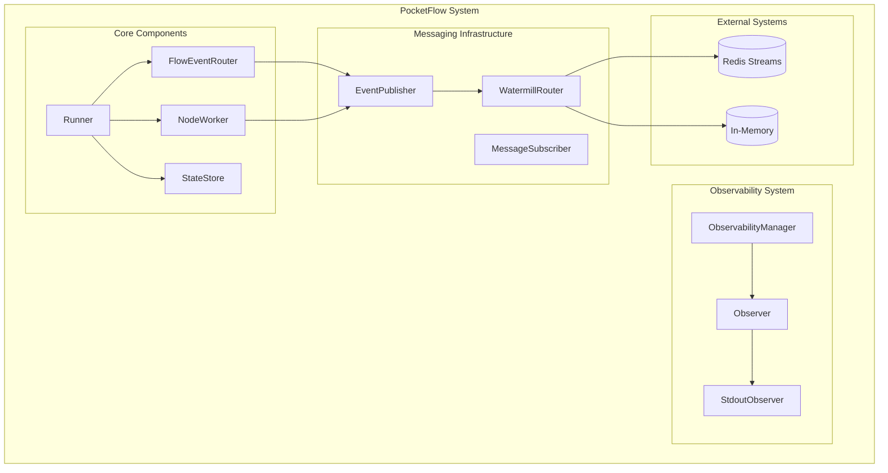
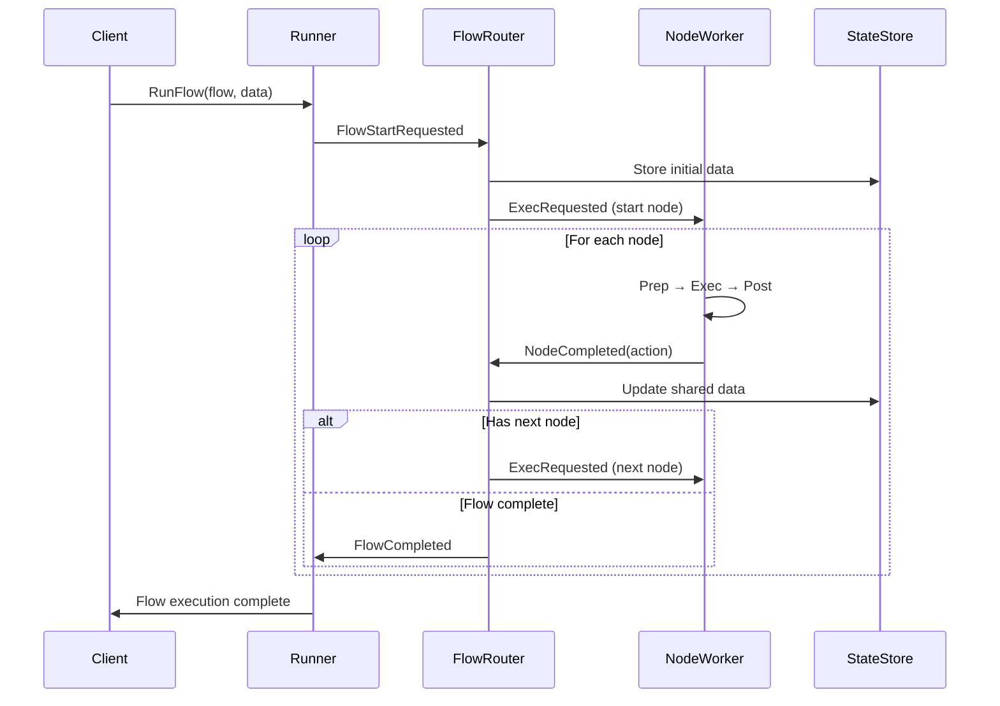
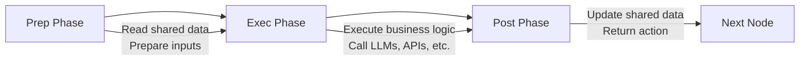
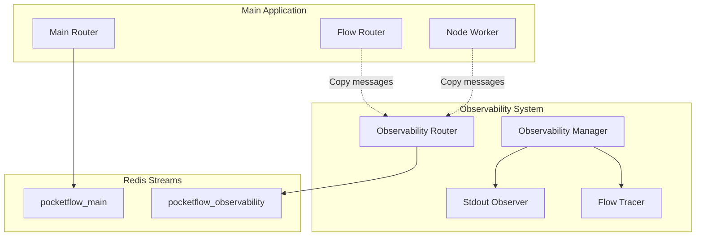

# PocketFlow Go Architecture: Complete System Design Guide

A comprehensive guide to the PocketFlow Go event-driven agent framework architecture, covering all components and their interactions.

## Overview

PocketFlow is a lightweight, event-driven framework for building LLM-powered applications using a graph-based workflow approach. The system is built around message-passing between components, enabling distributed execution, observability, and scalability.

**Key Characteristics:**
- **Event-Driven**: All communication happens via messages and topics
- **Distributed**: Components can run across multiple instances
- **Observable**: Built-in observability with separate consumer groups
- **Scalable**: Redis Streams for production, in-memory for development
- **Type-Safe**: Strong typing throughout the message system
- **Fault-Tolerant**: Circuit breakers, retries, dead letter queues

## Core Architecture

### System Components



## Core Interfaces

### Node Interface
```go
type Node interface {
    ID() string                        // Unique identifier (UUID)
    Type() string                      // Node type (e.g., "question", "llm_call")
    Name() string                      // Display name
    Params() map[string]interface{}    // Configuration parameters
}
```

### Flow Interface
```go
type Flow interface {
    ID() string                                                    // Unique identifier
    Type() string                                                  // Flow type
    StartNode() Node                                               // Entry point
    Nodes() map[string]Node                                        // All nodes by ID
    GetNextNode(currentNodeID, action string) (Node, bool)        // Navigation logic
    Visualize() string                                             // Mermaid diagram
}
```

### Worker Interfaces
```go
type NodeWorker interface {
    NodeType() string                      // Handled node type
    SupportedMessageTypes() []string       // Message types this worker handles
    HandleMessage(msg interface{}) error   // Process messages
    NewNode(params map[string]interface{}) Node  // Create nodes of this type
}

type SimpleNodeHandler interface {
    Prep(ctx NodeContext) (interface{}, error)                                    // Prepare data
    Exec(ctx NodeContext, prepResult interface{}) (interface{}, error)           // Execute logic
    Post(ctx NodeContext, prepResult, execResult interface{}) (string, interface{}, error) // Post-process
}
```

## Message System

### Message Types and Topics

| Message Type | Topic Pattern | Purpose | Publisher | Subscriber |
|--------------|---------------|---------|-----------|------------|
| `flow.start.requested` | `flow.{type}` | Start flow execution | Runner | FlowEventRouter |
| `node.exec.requested` | `{flowType}.node.{nodeType}` | Execute specific node | FlowEventRouter | NodeWorker |
| `node.completed` | `{flowType}.node.completed` | Node execution complete | NodeWorker | FlowEventRouter |
| `node.exec.failed` | `{flowType}.node.failed` | Node execution failed | NodeWorker | FlowEventRouter |
| `flow.completed` | `flow.completed` | Flow execution complete | FlowEventRouter | Runner |
| `flow.failed` | `flow.failed` | Flow execution failed | FlowEventRouter | Runner |
| `progress.update` | `progress` | Progress updates | All components | Observability |

### Base Message Structure
```go
type BaseMessage struct {
    MessageType     string    `json:"message_type"`
    FlowExecutionID string    `json:"flow_execution_id"`
    NodeExecutionID string    `json:"node_execution_id,omitempty"`
    FlowType        string    `json:"flow_type"`
    Timestamp       time.Time `json:"timestamp"`
}
```

### Key Message Types

#### Flow Messages
```go
type FlowStartRequestedMessage struct {
    BaseMessage
    FlowDefinitionID  string                 `json:"flow_definition_id"`
    InitialSharedData map[string]interface{} `json:"initial_shared_data"`
}

type FlowCompletedMessage struct {
    BaseMessage
    FinalAction   string      `json:"final_action"`
    FinalResult   interface{} `json:"final_result,omitempty"`
    ExecutionMs   int64       `json:"execution_ms"`
}

type FlowFailedMessage struct {
    BaseMessage
    NodeID         string `json:"node_id,omitempty"`
    ErrorMessage   string `json:"error_message"`
    ErrorDetails   string `json:"error_details,omitempty"`
    FailedNodeID   string `json:"failed_node_id,omitempty"`
}
```

#### Node Messages
```go
type ExecRequestedMessage struct {
    BaseMessage
    NodeType string                 `json:"node_type"`
    NodeID   string                 `json:"node_id"`
    Params   map[string]interface{} `json:"params,omitempty"`
}

type NodeCompletedMessage struct {
    BaseMessage
    NodeType     string      `json:"node_type"`
    NodeID       string      `json:"node_id"`
    Action       string      `json:"action"`      // Determines next node
    Result       interface{} `json:"result,omitempty"`
    Success      bool        `json:"success"`
    ErrorMessage string      `json:"error_message,omitempty"`
}

type ExecFailedMessage struct {
    BaseMessage
    NodeType     string `json:"node_type"`
    NodeID       string `json:"node_id"`
    ErrorMessage string `json:"error_message"`
    ErrorDetails string `json:"error_details,omitempty"`
    RetryCount   int    `json:"retry_count"`
    WillRetry    bool   `json:"will_retry"`
}
```

#### Progress Messages
```go
type ProgressUpdateMessage struct {
    BaseMessage
    Status   string  `json:"status"`   // "node_started", "node_completed", "flow_started", etc.
    Progress float64 `json:"progress"` // 0.0 to 1.0
    Message  string  `json:"message,omitempty"`
}
```

## Messaging Infrastructure

### Redis Streams (Production)

**Architecture:**
- **Consumer Groups**: Separate groups for main application and observability
- **Persistence**: Messages survive application restarts
- **Multi-Instance**: Multiple app instances share infrastructure
- **Message Replay**: Debug by replaying message streams

**Consumer Groups:**
- `pocketflow_main`: Main application processing
- `pocketflow_observability`: Observability and monitoring

**Configuration:**
```go
runner := NewRunnerWithRedis("localhost:6379",
    WithDebugMode(true),
    WithDatabaseURL("app.db"),
)
```

**Benefits:**
- ✅ **Persistent messaging**: Messages survive restarts
- ✅ **Consumer groups**: Proper message isolation and load balancing
- ✅ **Multi-instance**: Multiple app instances can share infrastructure
- ✅ **Message replay**: Debug issues by replaying message streams
- ✅ **Enterprise-ready**: Production-grade reliability and scalability
- ✅ **Dead letter queue**: Failed messages moved to `dead_letter_queue`
- ✅ **Circuit breaker**: Prevents cascading failures
- ✅ **Retry mechanism**: Exponential backoff with up to 3 attempts
- ✅ **Timeout protection**: 30-second timeout prevents hanging

### In-Memory (Development)

**Architecture:**
- **Go Channels**: Fast in-memory message passing
- **Shared Router**: All components use same message bus
- **No Persistence**: Clean slate for each run

**Configuration:**
```go
runner := NewRunner(
    WithDebugMode(true),
    WithDatabaseURL(":memory:"),
)
```

**Benefits:**
- ✅ **Simple setup**: No external dependencies
- ✅ **Fast development**: Immediate feedback loop
- ✅ **Testing**: Clean slate for each test run
- ✅ **Lightweight**: Minimal resource usage

### Middleware Stack

Both messaging systems include comprehensive middleware:

```go
func SetupRouterMiddlewares(router *message.Router, deadLetterPublisher message.Publisher, logger watermill.LoggerAdapter) {
    // Recovery middleware - prevents panics from crashing the router
    router.AddMiddleware(middleware.Recoverer)
    
    // Timeout middleware - prevents hanging handlers (30s timeout)
    router.AddMiddleware(middleware.Timeout(30 * time.Second))
    
    // Poison queue middleware - moves permanently failing messages to dead letter queue
    if deadLetterPublisher != nil {
        poisonQueueMiddleware, _ := middleware.PoisonQueue(deadLetterPublisher, "dead_letter_queue")
        router.AddMiddleware(poisonQueueMiddleware)
    }
    
    // Retry middleware with exponential backoff
    retryMiddleware := middleware.Retry{
        MaxRetries:      3,
        InitialInterval: 100 * time.Millisecond,
        MaxInterval:     1 * time.Second,
        Multiplier:      2.0,
    }
    router.AddMiddleware(retryMiddleware.Middleware)
    
    // Correlation ID middleware for distributed tracing
    router.AddMiddleware(middleware.CorrelationID)
}
```

## Runner: System Orchestrator

The `Runner` is the main entry point that orchestrates all system components.

### Core Responsibilities
1. **Component Initialization**: Sets up state store, messaging, flow registry
2. **Worker Registration**: Manages node workers and flow routers
3. **Flow Execution**: Coordinates flow execution and lifecycle
4. **Observability Integration**: Manages observability middleware
5. **Lifecycle Management**: Handles startup, shutdown, and state transitions

### Runner State Management
```go
type Runner struct {
    // Core components
    stateStore   semantic.StateStore
    flowRegistry core.FlowRegistry
    publisher    core.EventPublisher
    subscriber   message.Subscriber
    
    // Flow management
    flowRouters map[string]*FlowEventRouter  // One router per flow type
    nodeWorkers map[string]core.NodeWorker   // Shared across flows
    
    // Configuration and state
    options       RunnerOptions
    completeChans map[string]chan struct{}   // Flow completion tracking
    
    // Thread safety
    muNodeWorkers sync.RWMutex
    muFlowRouters sync.RWMutex
    muCompChans   sync.Mutex
    muState       sync.RWMutex
    
    // Runtime state
    isInitialized bool
    isRunning     bool
    
    // Observability
    observabilityPublisher message.Publisher
    observabilityTopic     string
    hasObservability       bool
    muObservability        sync.RWMutex
}
```

### Runner API

#### Basic Setup
```go
// Create runner
runner := NewRunner(
    WithDatabaseURL("app.db"),
    WithDebugMode(true),
    WithFlowCompletedHandler(func(r *Runner, msg core.FlowCompletedMessage) error {
        log.Info().Str("flowExecutionID", msg.FlowExecutionID).Msg("Flow completed!")
        return nil
    }),
)

// Initialize
runner.Init()

// Register workers
questionWorker := NewQuestionNodeWorker(runner.Publisher(), runner.StateStore())
runner.RegisterNodeWorker(questionWorker)

// Register flows
flow := createMyFlow()
runner.RegisterFlow(flow)

// Start system
runner.Start()

// Execute flows
flowID, err := runner.RunFlowAndWait(flow, initialData)
```

#### Redis Setup
```go
runner := NewRunnerWithRedis("localhost:6379",
    WithDebugMode(true),
    WithDatabaseURL("app.db"),
)
// ... rest is identical
```

#### With Observability
```go
runner := NewRunnerWithRedis("localhost:6379")
runner.Init()

// Setup observability
obsRouter, _ := NewObservabilityRouterWithRedis("localhost:6379", nil)
obsManager := NewObservabilityManager(obsRouter)
stdoutObserver := NewStdoutObserverWithOptions("console", true, false)
obsManager.AddObserver(stdoutObserver)
obsManager.Start()

// Register observability with runner
runner.RegisterObserver(obsRouter.Publisher, "observability")
```

## FlowEventRouter: Flow Execution Engine

Each flow type gets its own `FlowEventRouter` instance for isolated execution.

### Architecture
- **One Router Per Flow Type**: Isolated message handling and state
- **Flow-Scoped Topics**: Messages scoped to specific flow types
- **Node Coordination**: Orchestrates node execution and transitions
- **State Management**: Tracks flow execution state and progress

### Topic Structure
```
flow.{flowType}                    # Flow start requests
{flowType}.node.{nodeType}         # Node execution requests  
{flowType}.node.completed          # Node completion events
{flowType}.node.failed             # Node failure events
flow.completed                     # Global flow completions
flow.failed                        # Global flow failures
progress                           # Progress updates
```

### Flow Execution Lifecycle



### FlowEventRouter Implementation
```go
type FlowEventRouter struct {
    flowType    string                        // Flow type this router handles
    flow        core.Flow                     // Flow definition
    stateStore  semantic.StateStore           // Shared state management
    publisher   core.EventPublisher           // Message publishing
    router      *message.Router               // Watermill router
    subscriber  message.Subscriber            // Message subscription
    nodeWorkers map[string]core.NodeWorker    // Available node workers
    
    // State management
    isRunning   bool
    mu          sync.RWMutex
    ctx         context.Context
    cancel      context.CancelFunc
    logger      zerolog.Logger
}
```

### Handler Setup
```go
func (fer *FlowEventRouter) setupHandlers() error {
    // Flow start handler
    flowStartTopic := fmt.Sprintf("flow.%s", fer.flowType)
    fer.router.AddNoPublisherHandler(
        fmt.Sprintf("flow_%s_start", fer.flowType),
        flowStartTopic,
        fer.subscriber,
        fer.createFlowStartHandler(),
    )
    
    // Node execution handlers (one per node type in flow)
    for nodeID, node := range fer.flow.Nodes() {
        nodeType := node.Type()
        if worker, exists := fer.nodeWorkers[nodeType]; exists {
            topic := fmt.Sprintf("%s.node.%s", fer.flowType, nodeType)
            handlerName := fmt.Sprintf("flow_%s_node_%s_exec", fer.flowType, nodeType)
            
            fer.router.AddNoPublisherHandler(
                handlerName,
                topic,
                fer.subscriber,
                fer.createNodeExecHandler(worker),
            )
        }
    }
    
    // Node completion handler
    nodeCompletedTopic := fmt.Sprintf("%s.node.completed", fer.flowType)
    fer.router.AddNoPublisherHandler(
        fmt.Sprintf("flow_%s_node_completed", fer.flowType),
        nodeCompletedTopic,
        fer.subscriber,
        fer.createNodeCompletedHandler(),
    )
    
    return nil
}
```

### Observability Integration
```go
func (fer *FlowEventRouter) RegisterObservabilityMiddleware(observabilityPublisher message.Publisher, observabilityTopic string) {
    observabilityMiddleware := func(h message.HandlerFunc) message.HandlerFunc {
        return func(msg *message.Message) ([]*message.Message, error) {
            // Create observability copy
            observabilityMsg := msg.Copy()
            
            // Add metadata
            observabilityMsg.Metadata.Set("observability_source", "flow_router")
            observabilityMsg.Metadata.Set("original_message_id", msg.UUID)
            observabilityMsg.Metadata.Set("flow_type", fer.flowType)
            observabilityMsg.Metadata.Set("captured_at", time.Now().UTC().Format(time.RFC3339))
            
            // Publish to observability topic (non-blocking)
            go func() {
                if err := observabilityPublisher.Publish(observabilityTopic, observabilityMsg); err != nil {
                    fer.logger.Error().Err(err).Msg("Failed to publish to observability")
                }
            }()
            
            // Continue with original handler
            return h(msg)
        }
    }
    
    fer.router.AddMiddleware(observabilityMiddleware)
}
```

## NodeWorker: Task Execution

Node workers handle the actual execution of individual tasks within flows.

### SimpleNodeWorker Implementation

The `SimpleNodeWorker` provides a streamlined way to implement node workers using the three-phase execution pattern:

```go
type SimpleNodeWorker struct {
    nodeType  string                    // Type of node this worker handles
    handler   core.SimpleNodeHandler    // Business logic implementation
    publisher core.EventPublisher       // Message publishing
    store     semantic.StateStore       // State management
}
```

### Three-Phase Execution Pattern



#### Phase Details
1. **Prep Phase**: `Prep(ctx NodeContext) (interface{}, error)`
   - Read and prepare data from shared store
   - Validate inputs and parameters
   - Return prepared data for exec phase

2. **Exec Phase**: `Exec(ctx NodeContext, prepResult interface{}) (interface{}, error)`
   - Execute main business logic
   - Call LLMs, external APIs, perform computations
   - Should be idempotent (retryable)
   - Return execution result

3. **Post Phase**: `Post(ctx NodeContext, prepResult, execResult interface{}) (string, interface{}, error)`
   - Process execution results
   - Update shared state
   - Return action (determines next node) and final result

### NodeContext Structure
```go
type NodeContext struct {
    FlowExecutionID string                 // Current flow execution
    NodeID          string                 // Current node ID
    NodeType        string                 // Node type
    Params          map[string]interface{} // Node parameters
    SemanticData    *SemanticDataAccessor  // Shared data access
}
```

### Message Handling Flow
```go
func (n *SimpleNodeWorker) handleExecRequested(event core.ExecRequestedMessage) error {
    // Get shared data
    sharedData, err := n.store.GetSharedData(event.FlowExecutionID)
    if err != nil {
        return n.handleNodeExecError(event, err, 0, false)
    }
    
    // Create context
    ctx := semantic.NodeContext{
        FlowExecutionID: event.FlowExecutionID,
        NodeID:          event.NodeID,
        NodeType:        event.NodeType,
        Params:          event.Params,
        SemanticData:    semantic.NewSemanticDataAccessor(n.store, event.FlowExecutionID),
    }
    
    // Execute three phases
    prepResult, err := n.handler.Prep(ctx)
    if err != nil {
        return n.handleNodeExecError(event, err, 0, false)
    }
    
    execResult, err := n.handler.Exec(ctx, prepResult)
    if err != nil {
        return n.handleNodeExecError(event, err, 0, false)
    }
    
    action, result, err := n.handler.Post(ctx, prepResult, execResult)
    if err != nil {
        return n.handleNodeExecError(event, err, 0, false)
    }
    
    // Publish completion
    completionTopic := fmt.Sprintf("%s.node.completed", event.FlowType)
    return n.publisher.Publish(completionTopic, core.NodeCompletedMessage{
        BaseMessage: core.BaseMessage{
            MessageType:     core.MessageTypeNodeCompleted,
            FlowType:        event.FlowType,
            FlowExecutionID: event.FlowExecutionID,
            NodeExecutionID: event.NodeExecutionID,
            Timestamp:       time.Now(),
        },
        NodeType: n.nodeType,
        NodeID:   event.NodeID,
        Action:   action,
        Result:   result,
        Success:  true,
    })
}
```

### Progress Tracking
```go
func (n *SimpleNodeWorker) publishProgressUpdate(flowType, flowExecutionID, nodeExecutionID, status string, progress float64, message string) {
    n.publisher.Publish(core.TopicProgress, core.ProgressUpdateMessage{
        BaseMessage: core.BaseMessage{
            MessageType:     core.MessageTypeProgressUpdate,
            FlowType:        flowType,
            FlowExecutionID: flowExecutionID,
            NodeExecutionID: nodeExecutionID,
            Timestamp:       time.Now(),
        },
        Status:   status,    // "node_started", "node_prep", "node_exec", "node_post", "node_completed"
        Progress: progress,  // 0.0 to 1.0
        Message:  message,
    })
}
```

## State Management

### Shared Store Architecture

The state store provides a global data structure accessible by all nodes in a flow execution.

```go
type StateStore interface {
    GetSharedData(flowExecutionID string) (map[string]interface{}, error)
    UpdateSharedData(flowExecutionID, key string, value interface{}) error
    DeleteSharedData(flowExecutionID, key string) error
    ClearFlowData(flowExecutionID string) error
}
```

### Data Storage Patterns

#### Node Results by ID
```go
// Actual shared data structure (results stored by node ID)
shared := map[string]interface{}{
    "308b8a81-9fdf-4a41-8613-dab54dbbb50b": "What is AI?",        // user_input node result
    "d4c7958e-4074-44a6-8048-75b1392c94f9": "general_intent",     // intent_classifier result
    "started_at": "2025-05-23T11:41:50-04:00",                    // metadata
    "user_context": map[string]interface{}{                       // structured data
        "session_id": "sess_123",
        "preferences": map[string]string{"language": "en"},
    },
}
```

#### Semantic Data Access
```go
type SemanticDataAccessor struct {
    store           StateStore
    flowExecutionID string
}

// Access patterns for node results
func (sda *SemanticDataAccessor) GetNodeResults() map[string]interface{} {
    data, _ := sda.store.GetSharedData(sda.flowExecutionID)
    results := make(map[string]interface{})
    
    for key, value := range data {
        // Filter for UUID-like keys (node results)
        if isUUID(key) {
            results[key] = value
        }
    }
    return results
}

// Best practice: Access data by iteration, not hardcoded keys
func findUserInput(ctx NodeContext) string {
    for key, value := range ctx.SemanticData.GetNodeResults() {
        if userInput, ok := value.(string); ok && !strings.Contains(userInput, "_intent") {
            return userInput
        }
    }
    return ""
}
```

### Node Parameters vs Shared Data

| Aspect | Node Parameters | Shared Data |
|--------|----------------|-------------|
| **Purpose** | Immutable configuration | Mutable execution state |
| **Scope** | Single node | Entire flow |
| **Lifecycle** | Set at node creation | Updated during execution |
| **Usage** | Configuration, identifiers | Results, context, state |
| **Access** | `ctx.Params` | `ctx.SemanticData` |

## Flow Definition and Builder Pattern

### Flow Builder API
```go
type FlowBuilder struct {
    nodes       map[string]Node
    transitions map[string]map[string]Node  // nodeID -> action -> nextNode
    startNode   Node
}

// Sequential flow
flow := NewFlowBuilder().
    Begin(questionNode).
    Then(answerNode).
    Build()

// Branching flow
approvalFlow := NewFlowBuilder().
    Begin(reviewNode).
    On("approved", paymentNode).
    On("rejected", notifyNode).
    On("needs_revision", reviseNode).
    From(reviseNode).Then(reviewNode).    // Loop back
    From(paymentNode).Then(completeNode).
    From(notifyNode).Then(completeNode).
    Build()
```

### Flow Implementation
```go
type BasicFlow struct {
    id          string
    flowType    string
    nodes       map[string]Node
    transitions map[string]map[string]Node
    startNode   Node
}

func (f *BasicFlow) GetNextNode(currentNodeID, action string) (Node, bool) {
    if nodeTransitions, exists := f.transitions[currentNodeID]; exists {
        if nextNode, exists := nodeTransitions[action]; exists {
            return nextNode, true
        }
    }
    return nil, false
}

func (f *BasicFlow) Visualize() string {
    var mermaid strings.Builder
    mermaid.WriteString("flowchart TD\n")
    
    // Add nodes
    for nodeID, node := range f.nodes {
        mermaid.WriteString(fmt.Sprintf("    %s[%s]\n", nodeID, node.Type()))
    }
    
    // Add transitions
    for fromNodeID, transitions := range f.transitions {
        for action, toNode := range transitions {
            mermaid.WriteString(fmt.Sprintf("    %s -->|%s| %s\n", fromNodeID, action, toNode.ID()))
        }
    }
    
    return mermaid.String()
}
```

## Observability System

### Architecture Overview

The observability system provides comprehensive monitoring and debugging capabilities through a separate message stream.



### Consumer Group Isolation

**Main Application Consumer Group**: `pocketflow_main`
- Processes actual business logic
- Handles flow and node execution
- Updates shared state

**Observability Consumer Group**: `pocketflow_observability`
- Receives copies of all messages
- Provides monitoring and debugging
- Does not affect business logic

### Observability Interfaces

#### Observer Interface
```go
type Observer interface {
    GetName() string                           // Observer identifier
    IsEnabled() bool                           // Active status
    SetEnabled(enabled bool)                   // Enable/disable
    GetSubscribedTopics() []string             // Topics to monitor
    HandleMessage(msg *message.Message) error  // Process messages
}
```

#### ObservabilityManager Interface
```go
type ObservabilityManager interface {
    AddObserver(observer Observer) error       // Register observer
    RemoveObserver(name string) error          // Unregister observer
    GetObserver(name string) Observer          // Get by name
    ListObservers() []Observer                 // List all observers
    EnableObserver(name string) error          // Enable specific observer
    DisableObserver(name string) error         // Disable specific observer
    Start() error                              // Start observability system
    Stop() error                               // Stop observability system
}
```

### Observable Events

#### Event Types
```go
const (
    EventTypeFlowStarted   = "flow.started"
    EventTypeFlowCompleted = "flow.completed"
    EventTypeFlowFailed    = "flow.failed"
    EventTypeNodeStarted   = "node.started"
    EventTypeNodeCompleted = "node.completed"
    EventTypeNodeFailed    = "node.failed"
    EventTypeProgressUpdate = "progress.update"
)
```

#### Event Structures
```go
type FlowStartedEvent struct {
    BaseObservableEvent
    FlowType         string                 `json:"flow_type"`
    FlowDefinitionID string                 `json:"flow_definition_id"`
    InitialData      map[string]interface{} `json:"initial_data,omitempty"`
}

type NodeCompletedEvent struct {
    BaseObservableEvent
    NodeType string        `json:"node_type"`
    NodeID   string        `json:"node_id"`
    Action   string        `json:"action"`
    Result   interface{}   `json:"result,omitempty"`
    Duration time.Duration `json:"duration"`
}
```

### StdoutObserver Implementation

The `StdoutObserver` provides real-time console output with formatting and colors.

#### Features
- **Colorized Output**: ANSI color codes for different event types
- **Verbose Mode**: Show detailed information (parameters, results)
- **Timestamp Display**: Millisecond precision timestamps
- **ID Truncation**: Shortened UUIDs for readability
- **Event Formatting**: Structured, readable event display

#### Sample Output
```
15:04:05.123 flow.started    [a1b2c3d4] Flow 'qa_chain' started (def: basic_qa)
15:04:05.125 node.started    [a1b2c3d4] (e5f6g7h8) Node 'question_node' (question) started
15:04:05.127 progress.update [a1b2c3d4] (e5f6g7h8) Progress: node_prep (25.0%) - question node preparation phase
15:04:05.130 progress.update [a1b2c3d4] (e5f6g7h8) Progress: node_exec (50.0%) - question node execution phase
15:04:05.135 progress.update [a1b2c3d4] (e5f6g7h8) Progress: node_post (75.0%) - question node post-processing phase
15:04:05.138 node.completed  [a1b2c3d4] (e5f6g7h8) Node 'question_node' (question) completed in 13ms with action 'default'
15:04:05.140 node.started    [a1b2c3d4] (i9j0k1l2) Node 'answer_node' (answer) started
15:04:05.145 node.completed  [a1b2c3d4] (i9j0k1l2) Node 'answer_node' (answer) completed in 5ms with action 'default'
15:04:05.147 flow.completed  [a1b2c3d4] Flow 'qa_chain' completed in 24ms (2 nodes)
```

#### Configuration
```go
// Basic observer
stdoutObserver := NewStdoutObserver("console")

// With options
stdoutObserver := NewStdoutObserverWithOptions("console", true, false)  // colorized, not verbose

// Enable/disable features
stdoutObserver.SetColorized(false)  // Disable colors
stdoutObserver.SetVerbose(true)     // Enable verbose output
```

### Flow Tracing

The `StdoutFlowTracer` extends the basic observer to provide flow-level tracking.

#### FlowStatus Tracking
```go
type FlowStatus struct {
    FlowExecutionID  string                 `json:"flow_execution_id"`
    FlowType         string                 `json:"flow_type"`
    FlowDefinitionID string                 `json:"flow_definition_id"`
    Status           string                 `json:"status"` // "running", "completed", "failed"
    StartTime        time.Time              `json:"start_time"`
    EndTime          *time.Time             `json:"end_time,omitempty"`
    Duration         time.Duration          `json:"duration"`
    NodesExecuted    int                    `json:"nodes_executed"`
    CurrentNodeID    string                 `json:"current_node_id,omitempty"`
    FinalAction      string                 `json:"final_action,omitempty"`
    FinalResult      interface{}            `json:"final_result,omitempty"`
    ErrorMessage     string                 `json:"error_message,omitempty"`
    Metadata         map[string]interface{} `json:"metadata,omitempty"`
}
```

### Observability Setup

#### Basic Setup
```go
// Create observability router (separate consumer group)
obsRouter, err := NewObservabilityRouterWithRedis("localhost:6379", nil)
if err != nil {
    log.Fatal().Err(err).Msg("Failed to create observability router")
}

// Create manager
obsManager := NewObservabilityManager(obsRouter)

// Add observers
stdoutObserver := NewStdoutObserverWithOptions("console", true, false)
obsManager.AddObserver(stdoutObserver)

// Start observability system
obsManager.Start()

// Register with main runner
runner.RegisterObserver(obsRouter.Publisher, "observability")
```

#### Integration with Runner
```go
func (r *Runner) RegisterObserver(publisher message.Publisher, topic string) error {
    r.muObservability.Lock()
    defer r.muObservability.Unlock()
    
    // Store observability configuration
    r.observabilityPublisher = publisher
    r.observabilityTopic = topic
    r.hasObservability = true
    
    // Register middleware on all existing flow routers
    r.muFlowRouters.RLock()
    for flowType, flowRouter := range r.flowRouters {
        flowRouter.RegisterObservabilityMiddleware(publisher, topic)
    }
    r.muFlowRouters.RUnlock()
    
    return nil
}
```

## Node Worker Implementation Patterns

### 1. SimpleNodeHandler Pattern (Recommended)

For most use cases, implement the `SimpleNodeHandler` interface:

```go
type GreetingHandler struct{}

func (h *GreetingHandler) Prep(ctx NodeContext) (interface{}, error) {
    // Get name from parameters
    name, ok := ctx.Params["name"].(string)
    if !ok {
        return nil, fmt.Errorf("name parameter is required")
    }
    return name, nil
}

func (h *GreetingHandler) Exec(ctx NodeContext, prepResult interface{}) (interface{}, error) {
    name := prepResult.(string)
    greeting := fmt.Sprintf("Hello, %s!", name)
    return greeting, nil
}

func (h *GreetingHandler) Post(ctx NodeContext, prepResult, execResult interface{}) (string, interface{}, error) {
    greeting := execResult.(string)
    
    // Store result in shared data (optional)
    ctx.SemanticData.UpdateSharedData(ctx.NodeID, greeting)
    
    return "default", greeting, nil
}

// Create worker
greetingWorker := NewSimpleNodeWorker("greeting", &GreetingHandler{}, publisher, stateStore)
```

### 2. Function-Based Pattern

For simple nodes, use function-based builders:

```go
greetingWorker := NewNodeWorkerBuilder("greeting", publisher, stateStore).
    WithPrep(func(ctx NodeContext) (interface{}, error) {
        return ctx.Params["name"], nil
    }).
    WithExec(func(ctx NodeContext, prepResult interface{}) (interface{}, error) {
        name := prepResult.(string)
        return fmt.Sprintf("Hello, %s!", name), nil
    }).
    WithPost(func(ctx NodeContext, prepResult, execResult interface{}) (string, interface{}, error) {
        return "default", execResult, nil
    }).
    Build()
```

### 3. Full NodeWorker Implementation

For complex nodes requiring custom message handling:

```go
type CustomNodeWorker struct {
    nodeType  string
    publisher core.EventPublisher
    store     semantic.StateStore
}

func (w *CustomNodeWorker) NodeType() string {
    return w.nodeType
}

func (w *CustomNodeWorker) SupportedMessageTypes() []string {
    return []string{core.MessageTypeExecRequested}
}

func (w *CustomNodeWorker) HandleMessage(msgObj interface{}) error {
    msg := msgObj.(*message.Message)
    
    var execReq core.ExecRequestedMessage
    if err := json.Unmarshal(msg.Payload, &execReq); err != nil {
        return err
    }
    
    // Custom processing logic
    result, err := w.processCustomLogic(execReq)
    if err != nil {
        return w.publishError(execReq, err)
    }
    
    return w.publishCompletion(execReq, result)
}

func (w *CustomNodeWorker) NewNode(params core.NodeParams) core.Node {
    return &SimpleNode{
        id:       uuid.New().String(),
        nodeType: w.nodeType,
        params:   params,
    }
}
```

## Common Design Patterns

### 1. Question-Answer Agent
```go
// Create workers
questionWorker := NewSimpleNodeWorker("question", &QuestionHandler{}, publisher, stateStore)
answerWorker := NewSimpleNodeWorker("answer", &AnswerHandler{}, publisher, stateStore)

// Create nodes
questionNode := questionWorker.NewNode(map[string]interface{}{
    "prompt": "What is your question?",
})
answerNode := answerWorker.NewNode(map[string]interface{}{})

// Build flow
qaFlow := NewFlowBuilder().
    Begin(questionNode).
    Then(answerNode).
    Build()
```

### 2. Approval Workflow
```go
// Create workers
reviewWorker := NewSimpleNodeWorker("review", &ReviewHandler{}, publisher, stateStore)
processWorker := NewSimpleNodeWorker("process", &ProcessHandler{}, publisher, stateStore)
notifyWorker := NewSimpleNodeWorker("notify", &NotifyHandler{}, publisher, stateStore)
reviseWorker := NewSimpleNodeWorker("revise", &ReviseHandler{}, publisher, stateStore)
completeWorker := NewSimpleNodeWorker("complete", &CompleteHandler{}, publisher, stateStore)

// Create nodes
reviewNode := reviewWorker.NewNode(map[string]interface{}{})
processNode := processWorker.NewNode(map[string]interface{}{})
notifyNode := notifyWorker.NewNode(map[string]interface{}{})
reviseNode := reviseWorker.NewNode(map[string]interface{}{})
completeNode := completeWorker.NewNode(map[string]interface{}{})

// Build branching flow
approvalFlow := NewFlowBuilder().
    Begin(reviewNode).
    On("approved", processNode).
    On("rejected", notifyNode).
    On("needs_revision", reviseNode).
    From(reviseNode).Then(reviewNode).    // Loop back for revision
    From(processNode).Then(completeNode).
    From(notifyNode).Then(completeNode).
    Build()
```

### 3. Multi-Agent Coordination
```go
// Create specialized agent workers
plannerWorker := NewSimpleNodeWorker("planner", &PlannerAgent{}, publisher, stateStore)
researcherWorker := NewSimpleNodeWorker("researcher", &ResearcherAgent{}, publisher, stateStore)
writerWorker := NewSimpleNodeWorker("writer", &WriterAgent{}, publisher, stateStore)
reviewerWorker := NewSimpleNodeWorker("reviewer", &ReviewerAgent{}, publisher, stateStore)
finalizeWorker := NewSimpleNodeWorker("finalize", &FinalizeHandler{}, publisher, stateStore)

// Create nodes
plannerNode := plannerWorker.NewNode(map[string]interface{}{})
researcherNode := researcherWorker.NewNode(map[string]interface{}{})
writerNode := writerWorker.NewNode(map[string]interface{}{})
reviewerNode := reviewerWorker.NewNode(map[string]interface{}{})
finalizeNode := finalizeWorker.NewNode(map[string]interface{}{})

// Build coordination flow
coordinatorFlow := NewFlowBuilder().
    Begin(plannerNode).
    On("research_needed", researcherNode).
    On("writing_needed", writerNode).
    On("review_needed", reviewerNode).
    On("finalize", finalizeNode).
    From(researcherNode).Then(plannerNode).  // Return to planner
    From(writerNode).Then(plannerNode).      // Return to planner
    From(reviewerNode).Then(finalizeNode).   // Complete after review
    Build()
```

## Deployment and Operations

### Docker Deployment
```yaml
# docker-compose.yml
version: '3.8'
services:
  redis:
    image: redis:7-alpine
    ports:
      - "6379:6379"
    command: redis-server --appendonly yes
    volumes:
      - redis_data:/data
      
  pocketflow:
    build: .
    depends_on:
      - redis
    environment:
      - REDIS_ADDR=redis:6379
      - DATABASE_URL=postgres://user:pass@db:5432/pocketflow
    command: ./go -flow production_workflow -observability
    
  observability:
    build: .
    depends_on:
      - redis
    environment:
      - REDIS_ADDR=redis:6379
    command: ./go -observability-only -verbose

volumes:
  redis_data:
```

### Command-Line Interface
```bash
# Basic usage with Redis (default)
./go -flow basic                              # Run basic flow
./go -flow qa -observability                 # QA flow with monitoring
./go -flow branching -observability-verbose  # Verbose observability

# Redis configuration
./go -redis-addr redis:6379 -flow basic      # Custom Redis address
./go -redis=false -flow basic                # Use in-memory messaging

# Observability options
./go -observability                          # Enable observability
./go -observability-verbose                  # Verbose observability output
./go -observability-colorized=false          # Disable colors

# Development helpers
./go -visualize -flow basic                  # Show flow diagram only
./go -web                                    # Start web UI (port 8080)
./go -web -web-port 3000                     # Web UI on custom port
./go -help                                   # Show all options
```

### Monitoring and Debugging

#### Message Replay
```bash
# Redis CLI commands for debugging
redis-cli XREAD GROUP pocketflow_observability observer STREAMS observability 0

# View message history
redis-cli XRANGE observability - +

# Monitor live messages
redis-cli MONITOR
```

#### Flow Visualization
```go
// Generate Mermaid diagram
fmt.Println(flow.Visualize())

// Output:
// flowchart TD
//     question_node[question]
//     answer_node[answer]
//     question_node -->|default| answer_node
```

#### Health Checks
```go
// Check runner status
if runner.IsRunning() {
    fmt.Println("Runner is active")
    fmt.Printf("Active flow routers: %v\n", runner.GetRunningFlowRouters())
}

// Check flow status via observability
flowTracer := NewStdoutFlowTracer("tracer")
status, err := flowTracer.GetFlowStatus(flowExecutionID)
if err == nil {
    fmt.Printf("Flow status: %s, Duration: %v\n", status.Status, status.Duration)
}
```

## Best Practices

### Flow Design
1. **Start Simple**: Begin with linear flows before adding complexity
2. **Clear Actions**: Use descriptive action names for transitions
3. **Error Handling**: Include explicit error paths in flows
4. **Visualization**: Use `flow.Visualize()` to verify structure
5. **Testing**: Test individual nodes before integrating into flows

### Node Implementation
1. **Single Responsibility**: Each node should have one clear purpose
2. **Idempotent Design**: Nodes should be retryable without side effects
3. **Fail Fast**: Avoid complex error handling within nodes
4. **Detailed Logging**: Add comprehensive logging for debugging
5. **Parameter Validation**: Validate inputs in the Prep phase

### State Management
1. **Shared Store Design**: Plan your data structure upfront
2. **Immutable Params**: Use params for configuration, not mutable data
3. **Semantic Access**: Access shared data by iteration, not hardcoded keys
4. **Node ID Pattern**: Results are automatically stored with nodeID as key
5. **Data Lifecycle**: Consider cleanup and data retention policies

### Performance and Scalability
1. **Message Batching**: Group related operations when possible
2. **Resource Management**: Properly manage connections and resources
3. **Monitoring**: Use observability features to identify bottlenecks
4. **Consumer Groups**: Use separate consumer groups for isolation
5. **Circuit Breakers**: Leverage built-in fault tolerance features

### Observability
1. **Structured Logging**: Use consistent log formats and levels
2. **Progress Tracking**: Implement detailed progress updates
3. **Error Context**: Include sufficient context in error messages
4. **Metrics Collection**: Track key performance indicators
5. **Distributed Tracing**: Use correlation IDs for request tracking

This comprehensive architecture guide covers all aspects of the PocketFlow Go system, from core concepts to deployment strategies. The system provides a robust foundation for building sophisticated LLM-powered applications with enterprise-grade reliability and observability.