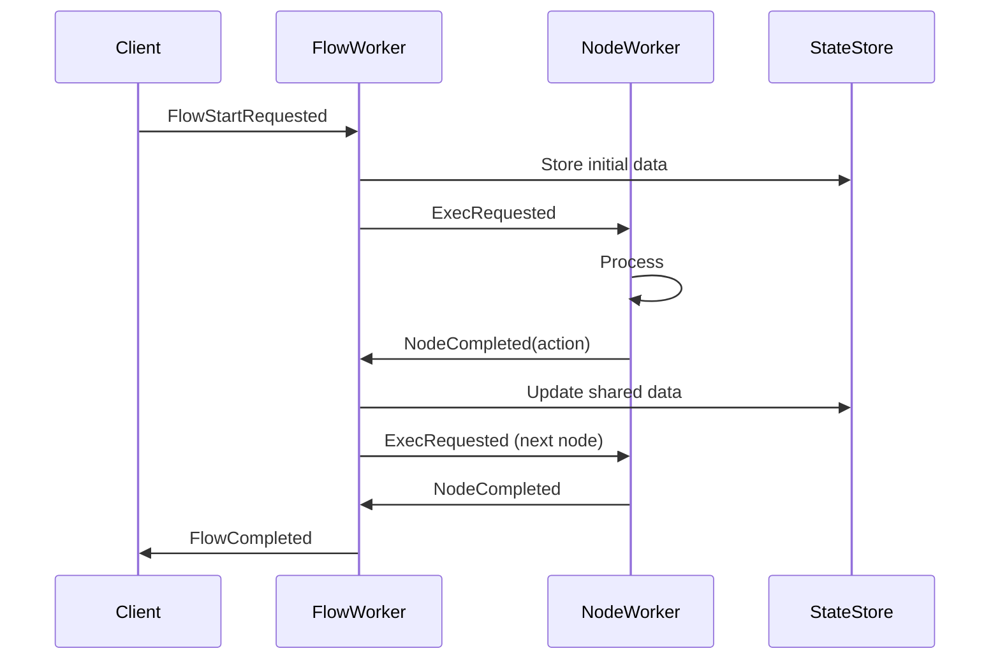

# PocketFlow Go Architecture: Concise Design Guide

A streamlined guide to the PocketFlow Go event-driven agent framework architecture.

## Core Concepts

PocketFlow is a lightweight framework for building LLM-powered applications using an event-driven, graph-based workflow approach:

- **Nodes**: Data structure used to create agent graphs
- **Flows**: Connected graphs of nodes with defined transitions
- **Workers**: Execute nodes and flows via message handling
- **Messages**: Communicate between components using pub-sub patterns
- **Topics**: Route messages to appropriate handlers (each node worker has a topic, so has the flow worker)

## Core Interfaces

### Node Interface
```go
type Node interface {
    ID() string                        // Unique identifier
    Type() string                      // Node type (e.g., "question", "llm_call")
    Name() string                      // Display name
    Params() map[string]interface{}    // Configuration parameters
}
```

### Flow Interface
```go
type Flow interface {
    ID() string                                                    // Unique identifier
    Type() string                                                  // Flow type
    StartNode() Node                                               // Entry point
    Nodes() map[string]Node                                        // All nodes
    GetNextNode(currentNodeID, action string) (Node, bool)        // Navigation logic
    Visualize() string                                             // Mermaid diagram
}
```

### Worker Interfaces
```go
type NodeWorker interface {
    NodeType() string                      // Handled node type
    SupportedMessageTypes() []string       // Message types this worker handles
    HandleMessage(msg interface{}) error   // Process messages
    NewNode(params map[string]interface{}) Node  // Create nodes of this type
    ...
}

type FlowWorker interface {
    FlowType() string                      // Handled flow type
    SupportedMessageTypes() []string       // Message types this worker handles
    HandleMessage(msg interface{}) error   // Process messages
    HandleNodeCompletedMessage(msg interface{}) error  // Handle node completions
    ...
}
```

## Message System

### Message Types
```go
// Flow lifecycle messages
const (
    MessageTypeFlowStartRequested = "flow.start.requested"
    MessageTypeFlowCompleted      = "flow.completed"
    MessageTypeFlowFailed         = "flow.failed"
)

// Node lifecycle messages
const (
    MessageTypeExecRequested = "node.exec.requested"
    MessageTypeNodeCompleted = "node.completed"
    MessageTypeExecFailed    = "node.exec.failed"
)

// Progress tracking
const (
    MessageTypeProgressUpdate = "progress.update"
)
```

### Base Message Structure
```go
type BaseMessage struct {
    MessageType     string    `json:"message_type"`
    FlowExecutionID string    `json:"flow_execution_id"`
    NodeExecutionID string    `json:"node_execution_id,omitempty"`
    Timestamp       time.Time `json:"timestamp"`
}
```

### Key Message Types
```go
type FlowStartRequestedMessage struct {
    BaseMessage
    FlowType          string                 `json:"flow_type"`
    FlowDefinitionID  string                 `json:"flow_definition_id"`
    InitialSharedData map[string]interface{} `json:"initial_shared_data"`
}

type ExecRequestedMessage struct {
    BaseMessage
    NodeType string                 `json:"node_type"`
    NodeID   string                 `json:"node_id"`
    Params   map[string]interface{} `json:"params,omitempty"`
}

type NodeCompletedMessage struct {
    BaseMessage
    NodeType string      `json:"node_type"`
    NodeID   string      `json:"node_id"`
    Action   string      `json:"action"`      // Determines next node
    Result   interface{} `json:"result,omitempty"`
}
```

## Topic Structure

| Topic Pattern | Purpose | Example |
|---------------|---------|---------|
| `node.{type}` | Node-specific messages | `node.question` |
| `node.completed` | All node completions | `node.completed` |
| `flow.{type}` | Flow-specific messages | `flow.qa_chain` |
| `flow.completed` | All flow completions | `flow.completed` |
| `progress` | Progress updates | `progress` |

## Messaging Infrastructure

### Redis Streams (Default)
```go
// Consumer groups for message isolation
// Main application: "pocketflow_main" 
// Observability:   "pocketflow_observability"

runner := NewRunnerWithRedis("localhost:6379")
```

**Benefits:**
- **Persistent messaging**: Messages survive application restarts
- **Consumer groups**: Proper message isolation and load balancing
- **Multi-instance**: Multiple app instances can share infrastructure
- **Message replay**: Debug issues by replaying message streams
- **Enterprise-ready**: Production-grade reliability and scalability

### In-Memory (Fallback)
```go
// For development and testing
runner := NewRunner()  // or ./go -redis=false
```

**Benefits:**
- **Simple setup**: No external dependencies
- **Fast development**: Immediate feedback loop
- **Testing**: Clean slate for each test run
- **Lightweight**: Minimal resource usage

### Comparison

| Feature | Redis Streams | In-Memory |
|---------|---------------|-----------|
| Persistence | ✅ Messages persist | ❌ Lost on restart |
| Multi-instance | ✅ Shared infrastructure | ❌ Isolated instances |
| Observability isolation | ✅ Separate consumer groups | ⚠️ Shared message bus |
| Setup complexity | ⚠️ Requires Redis | ✅ Zero dependencies |
| Production ready | ✅ Enterprise-grade | ❌ Development only |
| Message replay | ✅ Full replay capability | ❌ No message history |

## Flow Definition with Builder Pattern

### Simple Sequential Flow
```go
// Create nodes using workers
questionWorker := NewQuestionNodeWorker(publisher, stateStore)
answerWorker := NewAnswerNodeWorker(publisher, stateStore)

questionNode := questionWorker.NewNode(map[string]interface{}{
    "prompt": "What is your name?",
})
answerNode := answerWorker.NewNode(map[string]interface{}{})

// Build flow
flow := NewFlowBuilder().
    Begin(questionNode).
    Then(answerNode).
    Build()
```

### Branching Flow with Conditions
```go
// Create nodes using workers
reviewWorker := NewReviewNodeWorker(publisher, stateStore)
paymentWorker := NewPaymentNodeWorker(publisher, stateStore)
reviseWorker := NewReviseNodeWorker(publisher, stateStore)
finishWorker := NewFinishNodeWorker(publisher, stateStore)

reviewNode := reviewWorker.NewNode(map[string]interface{}{})
paymentNode := paymentWorker.NewNode(map[string]interface{}{})
reviseNode := reviseWorker.NewNode(map[string]interface{}{})
finishNode := finishWorker.NewNode(map[string]interface{}{})

// Build flow with conditional branches
approvalFlow := NewFlowBuilder().
    Begin(reviewNode).
    On("approved", paymentNode).
    On("rejected", finishNode).
    On("needs_revision", reviseNode).
    From(reviseNode).Then(reviewNode).    // Loop back
    From(paymentNode).Then(finishNode).
    Build()
```

## Node Worker Implementation Patterns

### Full NodeWorker Implementation
```go
type GreetingNodeWorker struct {
    Publisher  EventPublisher
    StateStore StateStore
}

func (w *GreetingNodeWorker) NodeType() string {
    return "greeting"
}

func (w *GreetingNodeWorker) NewNode(params map[string]interface{}) Node {
    return &GreetingNode{
        id:     generateID(),
        params: params,
    }
}

func (w *GreetingNodeWorker) HandleMessage(msgObj interface{}) error {
    // Parse message, execute logic, publish completion
    // See full implementation in detailed docs
}
```

### Simplified with SimpleNodeHandler
```go
type GreetingHandler struct{}

func (h *GreetingHandler) Prep(ctx NodeContext) (interface{}, error) {
    // Prepare for execution
}

func (h *GreetingHandler) Exec(ctx NodeContext, prepResult interface{}) (interface{}, error) {
    // Main execution logic
}

func (h *GreetingHandler) Post(ctx NodeContext, prepResult, execResult interface{}) (string, interface{}, error) {
    // Post-process and return action
}

// Wrap in SimpleNode
greetingWorker := NewSimpleNodeWorker("greeting", &GreetingHandler{}, publisher, stateStore)
```

### Function-based with NodeBuilder
```go
greetingWorker := NewNodeWorkerBuilder("greeting", publisher, stateStore).
    WithExec(func(ctx NodeContext, prepResult interface{}) (interface{}, error) {
        name := ctx.Params["name"].(string)
        return fmt.Sprintf("Hello, %s!", name), nil
    }).
    Build()
```

## Execution Flow

### Flow Lifecycle
1. **Start**: Client publishes `FlowStartRequestedMessage`
2. **Initialize**: Flow worker stores initial data, starts first node
3. **Execute Nodes**: Each node processes and returns an action
4. **Navigate**: Flow worker uses action to determine next node
5. **Complete**: When no next node exists, flow completes

### Message Flow Example


## State Management

### Shared Store
- **Purpose**: Global data structure accessible by all nodes
- **Usage**: Store flow execution data, node results, context
- **Design**: Typically an in-memory dictionary or database

```go
shared := map[string]interface{}{
    "user_input": "What is AI?",
    "llm_response": "AI is...",
    "conversation_history": []map[string]string{},
}
```

### Node Parameters
- **Purpose**: Immutable configuration for nodes
- **Usage**: Node-specific settings, identifiers
- **Scope**: Set by parent flow, available during execution

## Runner API

### Basic Setup (In-Memory)
```go
// Create and initialize runner with in-memory messaging
runner := NewRunner(
    WithDebugMode(true),
    WithDatabaseURL("app.db"),
)
runner.Init()

// Register workers
questionWorker := NewQuestionNodeWorker(runner.Publisher(), runner.StateStore())
answerWorker := NewAnswerNodeWorker(runner.Publisher(), runner.StateStore())
runner.RegisterNodeWorker(questionWorker)
runner.RegisterNodeWorker(answerWorker)

// Create nodes and flow
questionNode := questionWorker.NewNode(map[string]interface{}{
    "prompt": "What is your question?",
})
answerNode := answerWorker.NewNode(map[string]interface{}{})

flow := NewFlowBuilder().Begin(questionNode).Then(answerNode).Build()
runner.RegisterFlow(flow)

// Start and execute
ctx, cancel := runner.Start()
defer cancel()

flowID, err := runner.RunFlowAndWait(flow, initialData)
```

### Redis Streams Setup
```go
// Create and initialize runner with Redis Streams messaging
runner := NewRunnerWithRedis("localhost:6379",
    WithDebugMode(true),
    WithDatabaseURL("app.db"),
)
runner.Init()

// Everything else is the same as in-memory setup
// But now you get:
// - Persistent messaging via Redis Streams
// - Consumer groups for proper message isolation
// - Multi-instance support
// - Message replay capabilities
// - Enterprise-grade messaging infrastructure

// Register workers and flows (same as above)
questionWorker := NewQuestionNodeWorker(runner.Publisher(), runner.StateStore())
// ... rest of setup identical
```

### Enhanced with Observability
```go
// Create runner with Redis and observability
runner := NewRunnerWithRedis("localhost:6379",
    WithDebugMode(true),
)

// Setup observability (automatically uses separate Redis consumer group)
obsManager := NewObservabilityManager(runner.Subscriber())
stdoutObserver := NewStdoutObserverWithOptions("console", true, false)
obsManager.AddObserver(stdoutObserver)
obsManager.Start()

// Everything else is the same, but now you get:
// - Real-time console output with colors
// - Complete execution tracing across instances
// - Performance metrics
// - Flow visualization
// - Persistent observability data
// - Multi-instance monitoring

// Command-line alternatives:
// ./go -flow basic -observability              # Redis + observability
// ./go -redis=false -flow basic -observability # In-memory + observability
```

### Docker Deployment
```yaml
# docker-compose.yml
version: '3.8'
services:
  redis:
    image: redis:7-alpine
    ports:
      - "6379:6379"
    command: redis-server --appendonly yes
    volumes:
      - redis_data:/data
      
  pocketflow:
    build: .
    depends_on:
      - redis
    environment:
      - REDIS_ADDR=redis:6379
    command: ./go -flow production_workflow -observability

volumes:
  redis_data:
```

### Command-Line Reference
```bash
# Basic usage with Redis (default)
./go -flow basic                              # Run basic flow
./go -flow qa -observability                 # QA flow with monitoring
./go -flow branching -observability-verbose  # Verbose observability

# Redis configuration
./go -redis-addr redis:6379 -flow basic      # Custom Redis address
./go -redis=false -flow basic                # Use in-memory messaging

# Visualization and web UI
./go -visualize -flow basic                  # Show flow diagram only
./go -web                                    # Start web UI (port 8080)
./go -web -web-port 3000                     # Web UI on custom port

# Development helpers
./go -help                                   # Show all options
docker-compose up -d                         # Start Redis infrastructure
```

## Key Design Patterns

### 1. Agent Pattern
- Use branching flows with action-based transitions
- Implement decision nodes that return different actions
- Create loops for multi-step reasoning

### 2. Workflow Pattern
- Chain nodes in sequence using `Then()`
- Break complex tasks into smaller, manageable nodes
- Use shared state to pass data between nodes

### 3. RAG Pattern
- **Offline**: Chunk → Embed → Store (using BatchNode)
- **Online**: Query → Retrieve → Generate

### 4. Map-Reduce Pattern
- Use BatchNode for parallel processing
- Implement map phase with `prep()` returning iterable
- Implement reduce phase in `post()` with aggregated results

## Best Practices

### Flow Design
1. **Start Simple**: Begin with linear flows before adding complexity
2. **Clear Actions**: Use descriptive action names for transitions
3. **Error Handling**: Include explicit error paths in flows
4. **Visualization**: Use `flow.Visualize()` to verify structure

### Node Implementation
1. **Single Responsibility**: Each node should have one clear purpose
2. **Idempotent**: Design for potential retries
3. **Fail Fast**: Avoid complex error handling in nodes
4. **Logging**: Add detailed logging for debugging

### State Management
1. **Shared Store Design**: Plan your data structure upfront
2. **Immutable Params**: Use params for configuration, not data
3. **Data Flow**: Clearly define how data flows between nodes
4. **Cleanup**: Consider data lifecycle and cleanup

### Performance
1. **Batch Operations**: Use BatchNode for multiple similar operations
2. **Async Operations**: Use AsyncNode for I/O-bound tasks
3. **Resource Management**: Properly manage connections and resources
4. **Monitoring**: Use observability features to identify bottlenecks

## Common Patterns

### Question-Answer Agent
```go
questionWorker := NewQuestionNodeWorker(publisher, stateStore)
answerWorker := NewAnswerNodeWorker(publisher, stateStore)

questionNode := questionWorker.NewNode(map[string]interface{}{})
answerNode := answerWorker.NewNode(map[string]interface{}{})

qaFlow := NewFlowBuilder().
    Begin(questionNode).
    Then(answerNode).
    Build()
```

### Approval Workflow
```go
reviewWorker := NewReviewNodeWorker(publisher, stateStore)
processWorker := NewProcessNodeWorker(publisher, stateStore)
notifyWorker := NewNotifyNodeWorker(publisher, stateStore)
reviseWorker := NewReviseNodeWorker(publisher, stateStore)
completeWorker := NewCompleteNodeWorker(publisher, stateStore)

reviewNode := reviewWorker.NewNode(map[string]interface{}{})
processNode := processWorker.NewNode(map[string]interface{}{})
notifyNode := notifyWorker.NewNode(map[string]interface{}{})
reviseNode := reviseWorker.NewNode(map[string]interface{}{})
completeNode := completeWorker.NewNode(map[string]interface{}{})

approvalFlow := NewFlowBuilder().
    Begin(reviewNode).
    On("approved", processNode).
    On("rejected", notifyNode).
    On("needs_revision", reviseNode).
    From(reviseNode).Then(reviewNode).
    From(processNode).Then(completeNode).
    From(notifyNode).Then(completeNode).
    Build()
```

### Multi-Agent Coordination
```go
plannerWorker := NewPlannerNodeWorker(publisher, stateStore)
researcherWorker := NewResearcherNodeWorker(publisher, stateStore)
writerWorker := NewWriterNodeWorker(publisher, stateStore)
reviewerWorker := NewReviewerNodeWorker(publisher, stateStore)
finalizeWorker := NewFinalizeNodeWorker(publisher, stateStore)

plannerNode := plannerWorker.NewNode(map[string]interface{}{})
researcherNode := researcherWorker.NewNode(map[string]interface{}{})
writerNode := writerWorker.NewNode(map[string]interface{}{})
reviewerNode := reviewerWorker.NewNode(map[string]interface{}{})
finalizeNode := finalizeWorker.NewNode(map[string]interface{}{})

coordinatorFlow := NewFlowBuilder().
    Begin(plannerNode).
    On("research_needed", researcherNode).
    On("writing_needed", writerNode).
    On("review_needed", reviewerNode).
    From(researcherNode).Then(plannerNode).
    From(writerNode).Then(plannerNode).
    From(reviewerNode).Then(finalizeNode).
    Build()
```

This concise guide covers the essential architecture and patterns needed to build sophisticated LLM applications with PocketFlow Go. For detailed implementations and advanced features, refer to the complete architecture document. 